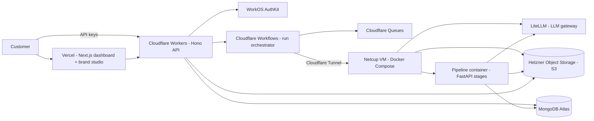
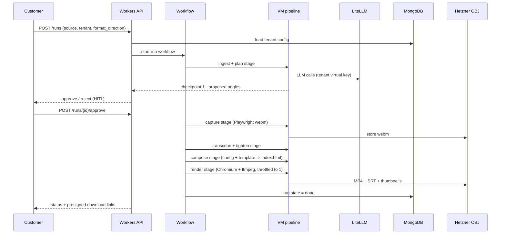

# ContentForge — Architecture

Research-grounded architecture for the merged agentic content production
SaaS. Built from a full audit of the code that actually exists in the
merged monorepo (2026-08-31), not from assumptions. Companion doc:
`.qwen/plans/plan.md` (phased build plan).

## 1. Domain model — two pipelines become one product

The product is one pipeline with a planning half and a production half,
currently orchestrated by two skills that must merge into one runtime.

```
source (URL / video / audio / text / idea / course module)
  -> PLAN    ingest -> analyze -> ideate -> research -> script -> storyboard
  -> PRODUCE capture (live web) -> tighten -> transcribe -> compose (HyperFrames)
             -> render -> slice -> caption + thumbnail -> deliver
  -> PUBLISH per-platform copy (caption-writer), board/calendar sync
```

| Capability | Today (source) | Merged home |
|---|---|---|
| Ingest (yt-dlp, youtube-transcript-api, trafilatura, whisper) | content-planner `scripts/ingest.py` | `python/scripts/ingest.py` |
| Research / topic engine / review | agentic-video-editing `python/agents/research/*` | `python/agents/research/*` |
| Copywriting + platform experts | agentic-video-editing `python/agents/{copywriter,experts}` | `python/agents/*` |
| Storyboard + animation director | agentic-video-editing `python/agents/storyboard/*` | `python/agents/storyboard/*` |
| Capture (Playwright recipes) | content-planner `scripts/capture.py` | `python/scripts/capture.py` |
| Tighten (word-accurate) | agentic-video-editing `scripts/tighten_words.py` | `python/scripts/tighten_words.py` |
| Transcribe (faster-whisper) | both (planner: mlx-whisper; video: faster-whisper) | `python/scripts/transcribe*.py`, unified on faster-whisper (non-mac) |
| Compose + render (HyperFrames) | agentic-video-editing `services/text_animator.py` + skill rules | `python/services/text_animator.py` + `skills/video-agent` |
| Slice / shorts / thumbnails / captions | both (build_shorts, slice, build_thumbnails, gen_captions) | `python/scripts/*` |
| Boards / calendar | content-planner `scripts/{board,workspace}.py` | `python/scripts/{board,workspace}.py` |

Two of the three big duplication areas are already merged (persona/voice,
brand tokens). The remaining duplication is the per-video hardcoding in
`build_shorts.py` / `gen_captions.py` (see plan A6) and the split prompt
sources (plan A10).

## 2. System context



## 3. Component architecture

### 3.1 Edge (Cloudflare) — `services/api`

Hono + Zod on Workers. Every request verifies a WorkOS JWT (JWKS) and
derives `tenant_id` from the `org_id` claim. Mongo queries are scoped by
`tenant_id`. Endpoints (planned):

| Endpoint | Purpose |
|---|---|
| POST /runs | start a pipeline run (`source`, `tenant`, `format_direction`) |
| GET /runs/:id | status + artifacts |
| POST /runs/:id/approve\|reject | HITL checkpoints |
| GET /projects | project list |
| GET/PUT /tenant/config | brand studio |
| POST /capture/recipes | generate a capture recipe from a URL |
| GET /media/* | presigned Hetzner OBJ URLs |

Workflows + Queues do durable orchestration: `step.waitForEvent` pauses at
HITL checkpoints; the workflow branches on `format_direction`
(short / long / long_to_short / short_to_long).

### 3.2 Pipeline (Netcup VM) — `workers/pipeline`

One FastAPI container that exposes the existing `python/` code as stages.
Each stage is the current script/agent behind a thin HTTP contract; the
workflow calls stages through the Tunnel with keys, never media.

| Stage | Implementation (exists today) |
|---|---|
| ingest | `python/scripts/ingest.py` |
| plan | planner agents (`skills/planner/agents/*`) + `python/agents/research/*` |
| write | `python/agents/copywriter.py` + experts |
| capture | `python/scripts/capture.py` (Playwright) |
| transcribe | `python/scripts/transcribe.py` (faster-whisper) |
| tighten | `python/scripts/tighten_words.py` + `audio_master.py` |
| compose | `python/services/text_animator.py` + `build_shorts.py` + `gen_captions.py` (de-hardcoded in P1) |
| render | `npx hyperframes render` + ffmpeg (CRF 10 master, CRF 14 social) |
| slice | `python/scripts/slice.py`, `remap_timeline.py` |
| deliver | `build_thumbnails.py` + SRT + captions, upload to OBJ |

The image is a plain Dockerfile (portable to Cloudflare Containers / Cloud
Run for burst). Render queue concurrency is a config value sized to the VM
(1 concurrent; ~3-4 GB per render on 8 GB).

### 3.3 LLM layer — `workers/litellm`

LiteLLM proxy (SQLite backend, MIT) on the VM. One virtual key per tenant
(budgets + rate limits). The existing `python/agents/synthesis/openai.py`
wrapper changes only its `base_url` to the proxy, so every agent stays on
the OpenAI SDK and no agent knows which provider serves it (hosted DeepSeek
by default, or tenant BYOK keys encrypted in the proxy). Prompts can carry
`model_family` hints that LiteLLM aliases route per family.

### 3.4 Web — `apps/web` (P4)

Next.js + shadcn/ui + Tailwind `@theme` tokens derived from the merged
brand config (obsidian `#12141C`, alabaster `#FAFAFA`, gold `#D4AF37`,
silentGray `#6B7280`). Dashboard, HITL approval UX, brand studio, media
library, landing page.

## 4. Dynamic config model (P1 core)

The product is "fully dynamic": a run is generated from validated config +
LLM, never from per-video hardcoded files. `config/` becomes a Pydantic
schema package.

```yaml
tenant:
  id: t_01
  slug: acme
  brand:            # from config/persona.yaml brand block today
    colors: { obsidian: "#12141C", alabaster: "#FAFAFA", gold: "#D4AF37", silent_gray: "#6B7280" }
    fonts: [Inter, "Playfair Display", "JetBrains Mono"]
  voice:            # from config/voice.md today
    grade: "5-6"
    rules: [no em-dashes, no emoji, spoken-flow, mechanism-first]
  persona: config/persona.yaml     # shared creator/tenant persona
  llm:
    mode: hosted                   # hosted | byok
    provider: deepseek
    model: deepseek-v4-flash
    key_ref: null                  # set when mode=byok
  templates: [short-form/vox, long-form/documentary]
  prompts: { copywriter: v1.1.2, review: v1.0.3 }
  formats: [long_to_short, short]  # allowed format_direction values
  recipes: [table-walkthrough, json-api-demo]
```

New tenant = validated blob + LiteLLM virtual key + OBJ prefixes, zero code
changes. Invalid config fails fast with actionable errors. The registries
(prompts, templates, recipes) are data files with semver; `prompts/
registry.yaml` already establishes the pattern.

## 5. Data model (MongoDB Atlas)

Collections per `docs/db_design.md`: `tenants`, `api_keys`, `projects`,
`runs`, `jobs`, `meters`. Every collection indexed and scoped by
`tenant_id`; `jobs.run_id` for stage tracking. Drivers: mongoose (API),
pymongo (pipeline). Media keys in Hetzner OBJ:
`tenants/{tenant_id}/{project_id}/{run_id}/{artifact}`. Run state today
lives in `python/state/pipeline.json`; P2 replaces it with Mongo runs/jobs.

## 6. One run end to end



## 7. Deployment topology

- Cloudflare: Workers API, Workflows, Queues, Tunnel (free tier first).
- Netcup VM (VPS 1000 G12, 4 vCPU / 8 GB): one `compose.yaml` with
  pipeline, LiteLLM, cloudflared. Zero public ports; UFW default-deny,
  fail2ban, unattended-upgrades; secrets in `.env` only.
- MongoDB Atlas Flex (managed; M0 for dev).
- Hetzner Object Storage (S3 API; 1 TB storage + 1 TB egress included).
- Vercel: Next.js web app (Hobby).
- Nightly `mongodump` -> Hetzner OBJ; Netcup COW snapshots.

## 8. Non-functional

- Security: WorkOS JWTs verified at the edge; VM has zero public ports;
  tenant isolation via tenant_id scoping + OBJ prefixes + signed URLs;
  LiteLLM encrypts BYOK keys.
- Observability: Arize OTEL (existing `python/services/arize.py`), Sentry,
  Cloudflare analytics, UptimeRobot, LiteLLM usage logs.
- Scaling: edge auto-scales; VM is the compute ceiling (1 concurrent
  render); burst = Cloudflare Containers with the same image.
- Cost: ~10-20/mo launch (VM + Hetzner + free tiers); DeepSeek
  `deepseek-v4-flash` keeps inference cents-level.

## 9. Key decisions (with evidence)

| Decision | Choice | Why |
|---|---|---|
| Monorepo | uv workspace | Both source repos are plain venv; uv unifies tooling |
| Orchestration | Cloudflare Workflows + Queues | Durable steps + `waitForEvent` HITL; replaces Celery/Redis |
| Pipeline compute | Netcup VM (owned) | No cold starts, cheap; Chromium + ffmpeg need a real box |
| Rendering location | VM, not Workers | Verified: Workers CPU ceiling + no ffmpeg; Browser Run cannot record video |
| LLM gateway | LiteLLM on VM | Agent-agnostic; per-tenant keys/budgets; BYOK; MIT |
| DB | MongoDB Atlas | No infra overhead; document-shaped run state |
| Media | Hetzner OBJ | S3 API; free ingress; 1 TB egress included |
| Voice/persona/brand | single `config/` source | Both pipelines already read persona/voice; dedupe complete |
| Transcribe | faster-whisper (CPU, VM) | Package; fine on 4-6 cores; planner's mlx-whisper is mac-only |

## 10. Risks

1. Single VM is the production brain — portability to Cloudflare Containers
   is the escape hatch (same image, config swap); nightly backups + COW
   snapshots cover the rest.
2. Concurrency ceiling (1 render at a time) — queue concurrency is a config
   value; burst via Cloudflare Containers later.
3. Hetzner egress is not free past 1 TB — monitor; R2-style free egress is
   not available.
4. Output quality drift from brand consistency — template registry
   constrains the LLM; review gates (PASS/FAIL) become code; golden-sample
   checks in CI.
5. The P0 merge has defects (plan section 4) — fix them before building
   P1+ on top.
