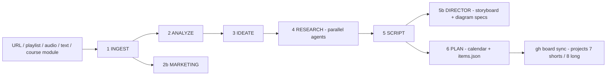
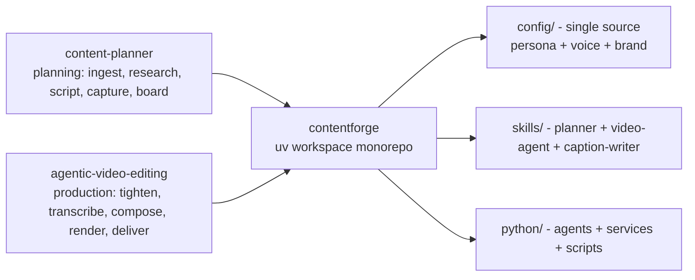
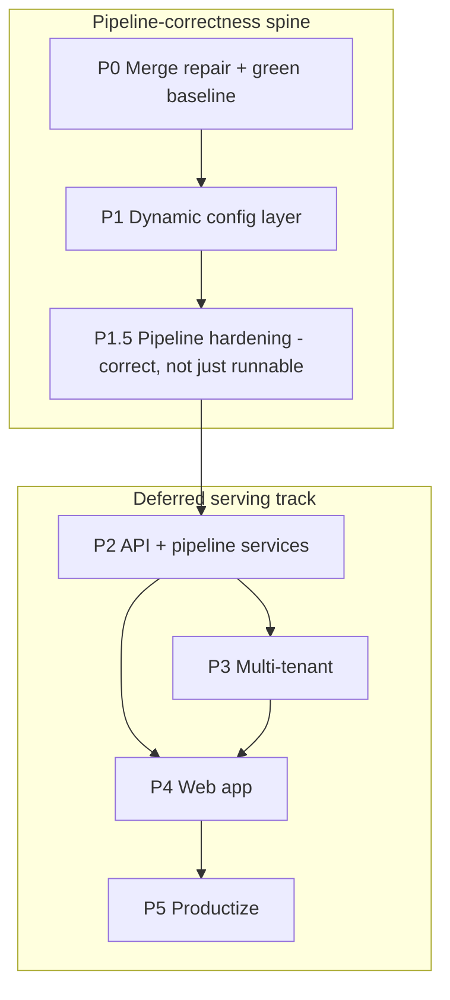

# ContentForge — Build Plan

Research-grounded plan for merging the two existing pipelines into one
sellable agentic SaaS. Written from a full audit of the merged monorepo on
`main` (2026-08-31). Companion doc: `.qwen/architecture/architecture.md`.

## 1. Mission

Merge `content-planner` (planning: ingest, research, script, capture,
board-sync) and `agentic-video-editing` (production: tighten, transcribe,
HyperFrames compose, render, deliver) into one fully dynamic, multi-tenant
content production SaaS. Nothing per-video is hardcoded; a tenant is a
validated config blob and the pipeline generates everything at runtime.
Ordering principle: prove the content + editing pipeline correct and fully
config-driven before any serving infrastructure exists (§5).

## 2. Source systems — verified research

### 2.1 content-planner (planning pipeline, v2.1.0)

Orchestrated by `skills/planner/SKILL.md`. Stage agents in
`skills/planner/agents/` (analyze, ideate, marketing, research, script,
director, plan, review, course-builder). Deterministic glue in
`python/scripts/` (`ingest.py`, `diagram.py`, `board.py`, `workspace.py`,
`common.py`). Config: `config/planner.yaml` (paths, boards 7/8, lifecycle),
single voice source `config/persona.yaml` + `config/voice.md`.

Pipeline: INGEST -> ANALYZE -> MARKETING -> IDEATE -> RESEARCH (parallel) ->
SCRIPT -> DIRECTOR (storyboard + diagram specs) -> PLAN -> board sync via
`gh` (GitHub Projects v2, boards 7 = shorts, 8 = long-form).

Data dirs (gitignored): `library/`, `outputs/`, `calendar/`, `workspace/`.

### 2.2 agentic-video-editing (production pipeline, v1.1.2)

Orchestrated by `skills/video-agent/SKILL.md` (self-contained master: hard
rules for round-PiP, word-accurate tightening, thumbnails + SRT always,
screen recording, self-review gate). Python agents in `python/agents/`
(copywriter, platform experts, research, storyboard/animation director,
synthesis via OpenAI-compatible wrapper), services in `python/services/`
(pixabay audio, text_animator HyperFrames orchestration, arize tracing),
`python/config/settings.py` (paths + persona/prompt loaders).

Pipeline: footage -> tighten (word-accurate) -> transcribe (faster-whisper)
-> beat-map -> compose (HyperFrames index.html) -> `npx hyperframes
lint/check` -> render CRF 10 master -> CRF 14 social -> SRT + thumbnails +
captions -> self-review gate -> deliver.

Supporting scripts (all ported, present in `python/scripts/`): `tighten*`,
`transcribe*`, `clean_vo`, `audio_master`, `slice`, `remap_timeline`,
`build_shorts`, `gen_captions`, `build_thumbnails`, `verify_pip`,
`audit_pip_collisions`, `serve_teleprompter`. Root-level `scripts/`:
`edit_video.py`, `synth_audio.py`, `fetch_font.py`, `fetch_pixabay.mjs`.

## 3. Current merged state (contentforge `main`)

The P0 monorepo consolidation is committed (`293eb23`). Present today:
uv workspace root (`pyproject.toml`, member `python/`), merged `skills/`
(planner, video-agent, video-editor, caption-writer, engineering), merged
`python/` (agents, services, scripts, config, state), `config/` (persona,
voice, planner), `prompts/` (registry), `templates/` (short-form, courses),
`docs/`, `deploy/`, unified `.env.example`. No `apps/`, `services/`, or
`workers/` yet (those are P2/P4 targets).

## 4. P0 merge audit — findings to fix before building on top

The merge is structurally complete but has concrete defects. Every item
below is verified against the tree.

| # | Finding | Evidence | Fix |
|---|---|---|---|
| A1 | `load_persona()` is broken | `python/config/settings.py` sets `PERSONA_PATH = PROJECT_ROOT / "persona.yaml"`, but the file lives at `config/persona.yaml`. `load_persona()` raises FileNotFoundError. Callers: copywriter, all research agents, storyboard, text_animator. | Point `PERSONA_PATH` at `config/persona.yaml`; add a repo-root smoke test that imports and loads persona. |
| A2 | Stale root-relative script refs in skills | `skills/video-agent/SKILL.md` and `skills/planner/SKILL.md` (and planner agents) invoke `scripts/<x>.py`; the merged layout is `python/scripts/<x>.py`. | Update skill docs to `python/scripts/...`; add a ref-check to the smoke test. |
| A3 | Requirements split across files | `python/requirements.txt` (video pipeline) is missing planner deps (PyYAML, mlx-whisper, playwright, trafilatura, youtube-transcript-api, yt-dlp); `python/requirements-planner.txt` holds those; `python/pyproject.toml` already unifies all (platform-conditional faster-whisper). | Treat `python/pyproject.toml` as the single dependency source; delete or clearly mark the two requirements.txt files as legacy. |
| A4 | Duplicate .env examples | `.env.example` (root, unified) vs `python/.env.example` (video-only, stale). | Delete `python/.env.example`; keep root unified file. |
| A5 | Non-portable font paths | `build_thumbnails.py` hardcodes macOS font paths (`/System/Library/Fonts/...`). VM is Linux. | Resolve fonts from a config key with cross-platform fallback (or bundle fonts). |
| A6 | Per-video hardcoding remains | `build_shorts.py` and `gen_captions.py` hardcode `outputs/m1-longform-what-is-an-ai-agent/` and fixed short segments. | P1 must convert these to read run/tenant config; the smoke test should generate a synthetic run, not a hardcoded slug. |
| A7 | Two output conventions | Video pipeline writes `output/`, planner writes `outputs/` (config-driven). | Unify on config-driven `outputs/` (planner convention); update `text_animator.py` `OUTPUT_DIR`. |
| A8 | Brand token key mismatch | `schemas.py` `BrandColors` uses `silentGray`; `persona.yaml` uses `silent_gray`; `animation_director.py` reads both. | Single canonical key (recommend `silent_gray` in YAML config, map in the Pydantic model). |
| A9 | Committed runtime state | `python/state/pipeline.json` and `topic_history.json` are committed. | Gitignore `python/state/*.json` (P1 replaces with DB-backed state anyway). |
| A10 | Prompt sources split | Video pipeline prompts in `python/agents/prompts/`; planner stage agents in `skills/planner/agents/`; registry at `prompts/registry.yaml` only partially covers both. | P1 consolidates into the registry with versions (registry already defines the pattern). |
| A11 | Skill path references stale | Planner agents reference `skill/templates/...` and `skill/agents/...`; merged path is `skills/planner/...`. | Update references (same fix as A2). |
| A12 | Settings persona path + skill/caption-writer | `skills/caption-writer/SKILL.md` reads `persona.yaml` at repo root. | Point to `config/persona.yaml`. |

Status (2026-08-31, commit `37e75ac`): A1-A4, A7-A9, A11-A12 fixed and
committed — persona path verified (`load_persona()` returns), skill refs
updated, `pyproject.toml` is the single dep source (legacy `requirements*.txt`
deleted), `python/.env.example` removed, output dir unified on `outputs/`,
`silent_gray` canonical, runtime state untracked. A5 (fonts), A6 (per-video
hardcoding), A10 (prompt registry) remain: A6 + A10 are P1 work, A5 folds
into the P1.5 font policy.

Acceptance for the audit: `uv run` a repo-root smoke test that (a) imports
`config.settings` and loads persona, (b) lints all python with ruff, (c)
runs `python/scripts/{capture,tighten_words,transcribe}.py --help`
end-to-end on a synthetic fixture, (d) greps for any root-relative
`scripts/` and macOS font paths. Exit 0.

## 5. Build phases — pipeline-correctness spine first, serving deferred

Ordering principle: prove the content + editing pipeline is correct and
fully config-driven BEFORE any serving infrastructure. Everything a customer
touches in P2-P5 (API, queues, VM, tunnel, auth, billing) is deferred behind
the P1.5 proof gate, and its final shape is re-decided with real per-stage
telemetry (durations, resource use, failure modes) — not guessed up front.

P0-P1.5 are the only phases that touch pipeline code. The serving track is
deliberately deferred: P2 starts only when the P1.5 gate is green, and its
infra design is revisited with real measurements first.

### P0 — Merge repair + green baseline (issue #1)

- Fix A1-A12 above.
- Unify `python/` deps on `pyproject.toml`; `uv sync` works from repo root.
- One persona, one voice ruleset, one brand token source (`config/`).
- Zero cross-repo absolute paths; zero macOS-only paths in code.
- LOCAL smoke test exits 0 (capture + tighten_words + transcribe dry run on
  synthetic media). No CI wiring in P0.
- Update `skills/` runbooks so every command they document runs from the
  merged layout.

AC: every script from both pipelines runs from contentforge; zero stale
path refs; one persona/voice/brand source; smoke test green.

### P1 — Dynamic config layer (issue #2)

Everything becomes data: tenant config, prompts, templates, recipes.

- `config/` schema package (Pydantic): `TenantConfig` (brand tokens, fonts,
  voice, persona, models), `PromptRef`, `TemplateRef`, `RecipeRef` with
  strict validation and actionable errors. Reuse `python/agents/schemas.py`
  models; fix the brand-key mismatch (A8).
- Prompt registry: versioned, loadable by name — extend
  `prompts/registry.yaml` to cover planner agents + video prompts (A10).
- Template registry: HyperFrames templates as data; scenes generated from
  config + LLM (convert `build_shorts.py`/`gen_captions.py` off hardcoded
  slugs, A6).
- Recipe library: capture recipes as data; LLM generates a recipe from a
  URL/script.
- Config overrides + fail-fast validation; `config/settings.py` becomes a
  thin loader over the schema.

AC: new tenant = new validated config blob, zero code changes; invalid
config rejected with actionable errors; a sample tenant renders a demo
video end-to-end from config alone.

### P1.5 — Pipeline hardening: correct, not just runnable (issue #2 scope)

A single demo video is a milestone, not proof — regression checks are the
proof. This pass makes the pipeline provably correct and repeatable before
anything is allowed to serve it.

- Fixture suite: checked-in synthetic + real fixtures per stage, with golden
  outputs (tightened transcript, SRT, captions, thumbnail) and deterministic
  assertions — not just "exit 0".
- Prove the reconstructed scripts against fixtures: `tighten_words.py`
  (word-boundary silence removal + lead/tail pads), `verify_pip.py`,
  `audit_pip_collisions.py`, `build_thumbnails.py` (no hardcoded titles or
  output names, A6).
- `format_direction` matrix end-to-end: `short`, `long`, `long_to_short`,
  `short_to_long` all produce valid, aligned deliverables from one master.
- Editing-quality gates: tightening respects word boundaries and pads; SRT /
  captions align to the tightened timeline; round-PiP and brand tokens come
  from config, never code.
- Font policy (A5): resolve fonts from config with a cross-platform fallback
  (bundle Inter / JetBrains Mono / Playfair as the source repos did); kill
  `/System/Library/Fonts` assumptions.
- Golden render: the P1 sample-tenant render is checked in; a regenerate-diff
  check catches silent regressions.
- Repo hygiene: `make lint` + `make test` + `make smoke` all green locally.

AC: fixture suite green; `format_direction` matrix proven; golden render
reproducible from config alone; zero hardcoded per-video content.

### P2 — API + pipeline services (issue #3) — deferred, gated on P1.5

**Gate:** starts only after the P1.5 AC is green. **Design revisit:** the
infra shape is re-decided at P2 start using real stage telemetry from P1.5.
Working default (see §6): durable queue + generic worker containers — one VM
today, more VMs/containers later with the same image. Avoid a fixed
tunnel host with cross-network step orchestration.

Edge API on Cloudflare Workers (Hono); pipeline on the Netcup VM; Workflows
orchestrates via Tunnel. Details in `.qwen/architecture/architecture.md`
and `docs/lld.md`.

- `services/api` (Hono + Zod + mongoose): /runs, /projects, /tenant/config,
  /media, HITL approve/reject — WorkOS JWT at the edge, MongoDB-backed.
- `workers/pipeline` (FastAPI): reuse `python/` agents + scripts as stages
  (ingest, plan, capture, transcribe, tighten, compose, render, deliver).
- `workers/litellm`: agent-agnostic LLM gateway, per-tenant virtual keys.
- Cloudflare Workflows + Queues orchestrate runs (`step.waitForEvent` at
  HITL checkpoints, `format_direction` branches).
- MongoDB Atlas collections per `docs/db_design.md`; Hetzner OBJ media with
  per-tenant prefixes + signed URLs.
- Netcup VM Docker Compose: pipeline + LiteLLM + cloudflared, zero public
  ports; render queue concurrency = 1.
- HITL checkpoints as API endpoints, replacing `python/state/pipeline.json`.

AC: full pipeline runs headless via API with job status tracking, all four
`format_direction` values; HITL approvals flow through the API; artifacts
land in Hetzner OBJ; run state survives restarts in MongoDB.

### P3 — Multi-tenant layer (issue #4)

- WorkOS AuthKit: orgs = tenants, RBAC roles, MFA, social login.
- Tenant isolation: Mongo queries scoped by `tenant_id`, OBJ prefixes,
  LiteLLM virtual key per tenant.
- Tenant provisioning API (WorkOS org + config blob + OBJ prefixes +
  LiteLLM key).
- Usage metering: runs, renders, LLM spend (LiteLLM budgets + meters).

AC: two tenants never share data or config; provisioning via API; usage
recorded per tenant.

### P4 — Web app (issue #5)

- `apps/web` Next.js + shadcn/ui + Tailwind `@theme` brand tokens
  (obsidian / alabaster / gold / silent_gray) on Vercel.
- Dashboard: projects, pipeline runs, HITL approval UX, render queue +
  download.
- Brand studio: per-tenant editor for brand, voice, templates, recipes,
  models.
- Media library + capture recipe builder; public landing page.

AC: user runs a full pipeline from the browser; approve/reject at
checkpoints; download deliverables; brand studio changes take effect on the
next run without code changes.

### P5 — Productization (issue #6)

- Stripe billing, plans + quotas, usage-based pricing.
- Onboarding, docs (Mintlify), pricing page, public site.
- Security review, rate limits, data residency.
- Sellable demo + first customers.

AC: self-serve onboarding; billing accurate; security review clean;
sellable demo.

## 6. Cross-cutting rules

- Conventional commits; keep the repo green before every commit.
- No emoji in any file. Follow existing SOLID/KISS/DRY conventions.
- No pipeline or product decision is locked by infra: the pipeline must run
  identically as a local CLI run (P0-P1.5) and as a queue-fed worker job
  (P2+, deferred). The runbook stays the source of truth; a container is a
  thin wrapper over the same stages.
- `skills/video-agent/SKILL.md` remains the single source of truth for
  video production rules; config references replace any path assumptions.
- Render concurrency = 1 locally (VM: 4 vCPU / 8 GB). Scale path (deferred):
  the same worker image on more VMs or a container service — a queue +
  identical containers, never a hand-rolled fleet.
- Cost discipline: free-tier-first; default model DeepSeek
  `deepseek-v4-flash`; monitor Hetzner egress.

## 7. Open questions / decisions

Resolved (2026-08-31):

1. **Lint policy — DECIDED (A):** ignore E501/N806 in `[tool.ruff.lint]`
   (`python/pyproject.toml`); `ruff check python/` and `make lint` exit 0.
   123 long lines + 11 uppercase-in-function names are intentional in the
   scripts; no enforced rule was lost. Applies to the `make lint` gate.
2. **Pricing model (credits vs seats)** - defer to P5; P3 metering records
   raw usage (runs, render-minutes, tokens), never prices.
3. **Branding/domain** - defer to P5; brand is config tokens from P1, so a
   later name/brand swap is config + rename, not rework.
4. **P2 infra shape** - defer, revisit at P2 start with stage telemetry from
   P1.5. Working default: queue + identical worker containers (§5, §6).
5. **P0 smoke-test venue - OPEN (blocks P0 close):** run the ~1 GB runtime
   install (Chromium, whisper-tiny, ffmpeg) in the dev sandbox to close the
   P0 gate, or defer the run to the Netcup VPS? Recommendation: sandbox.
6. **AVE `assets/audio/` media library (15 music/SFX files) - DECIDED:**
   excluded by design - no code references it; audio is fetched per project
   from Pixabay at runtime (`scripts/fetch_pixabay.mjs`). Re-add only if the
   library itself becomes a product asset.

Resolved earlier: source-repo access (cloned into `_sources/` with `gh auth`)
and board #10 read/write (`gh` scopes granted) - both no longer blockers.
