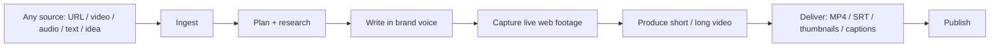
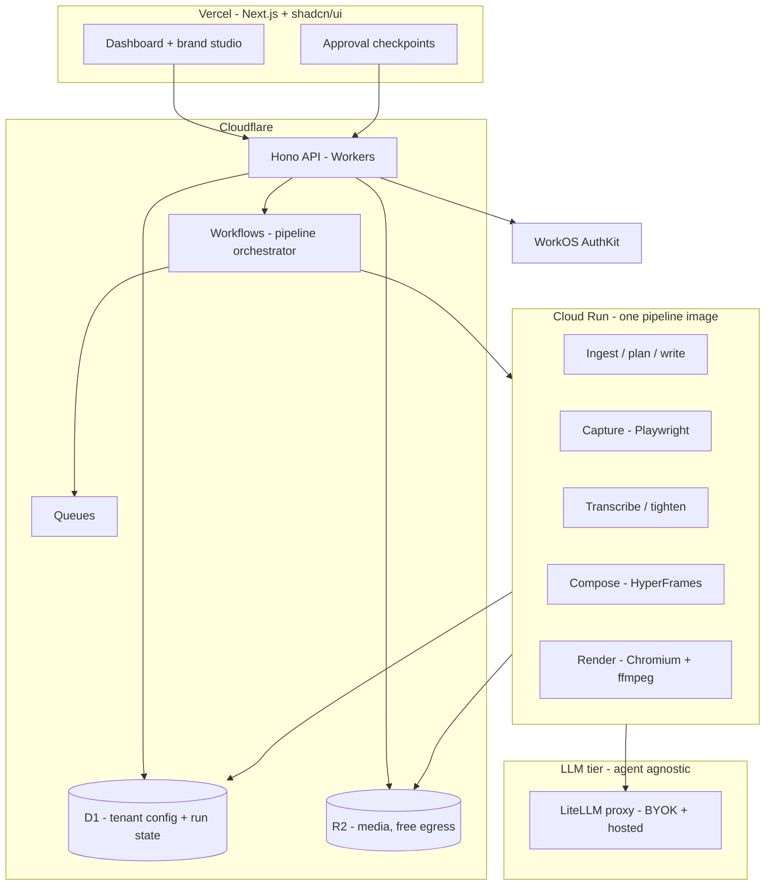
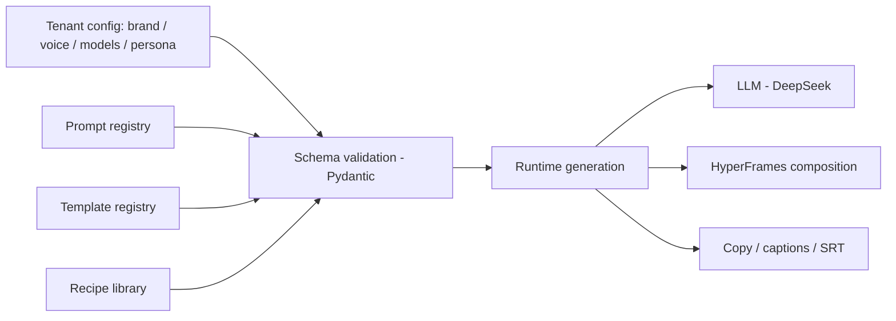
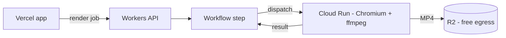
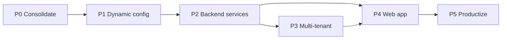

# ContentForge — Agentic Content Production SaaS

Merge of `content-planner` (planning: ingest, research, script, capture) + `agentic-video-editing` (production: tighten, transcribe, compose, render, deliver) into one sellable, fully dynamic, multi-tenant platform.

**Fully dynamic** = everything is generated at runtime from validated config + LLM (prompts, templates, scenes, recipes — nothing hardcoded per video) **and** customers customize brand, voice, and templates per tenant.

## Product Pipeline

## Target Architecture (Cloudflare-first)

Detailed design: **[docs/hld.md](docs/hld.md)** (high-level) and **[docs/lld.md](docs/lld.md)** (low-level: schemas, endpoints, workflows, LLM layer).

## Dynamic Model

Nothing per-video is hardcoded. A tenant is a validated config blob; the pipeline reads config + registries and generates the composition, copy, and capture recipes at runtime.

## Render Tier

Research-verified: Cloudflare Workers cannot encode video (5 min CPU ceiling, 128 MB isolates) and Cloudflare Browser Run cannot record video (screenshots/PDF only). Rendering and capture both run on Cloud Run; everything else is Cloudflare.

| Option | Role | Verdict |
|---|---|---|
| Vercel | Next.js app, dashboard, brand studio | Use for the web app |
| Cloudflare Workers | API, Workflows, Queues, D1, R2 | Primary platform |
| Cloudflare Browser Run | Edge browser | Not for video (no recording) — capture stays on Cloud Run Playwright |
| Google Cloud Run | Pipeline + render container (Chromium + ffmpeg, scale-to-zero) | Primary compute |
| Cloudflare Containers | CF-native container runtime | Watch — potential Cloud Run replacement |

## Roadmap

P0-P2 are the foundation and must land in order. P3 (tenant isolation) and P4 (dashboard) can partially overlap after P2.

---

## P0 — Consolidation (monorepo)

Merge both repos into `contentforge`; resolve duplication; everything runs from one place.

Steps:
1. Monorepo layout (uv workspace): `apps/web/` (Next.js), `services/api/` (Workers + Hono), `workers/pipeline/` (FastAPI on Cloud Run), `workers/litellm/`, `python/` (agents + scripts from both), `skills/`, `prompts/`, `templates/`, `config/`, `docs/` (hld.md + lld.md live here)
2. Move `content-planner`: `skill/` (v2.1.0), `scripts/` (ingest, diagram, board, workspace, capture, transcribe, tighten, slice, gen_captions, audio_master, build_shorts, serve_teleprompter), `library/` + `outputs/` + `calendar/` + `workspace/` as gitignored data dirs
3. Move `agentic-video-editing`: `skills/video-agent` (v1.1.2), `python/agents`, `python/services`, `python/config/settings.py`, `templates/`, `prompts/`, `docs/`
4. Dedupe: one `config/persona.yaml` (merge content-planner `skill/persona.yaml` + video root `persona.yaml`), one voice/caption ruleset, brand tokens as config (obsidian / alabaster / gold / silentGray)
5. Reconcile missing scripts referenced by video-agent but absent here: `build_thumbnails.py`, `verify_pip.py`, `audit_pip_collisions.py`, `tighten_words.py` (port from content-planner)
6. Replace hardcoded `/Users/noahsheldon/Documents/Work_Projects/content-planner` path in `skills/video-agent/SKILL.md` with a config setting
7. Unified `requirements.txt` + `.env.example` (DEEPSEEK_API_KEY, ARIZE, X_BEARER_TOKEN, OPENAI_API_KEY, PIXABAY)

Acceptance criteria:
- Every script from both pipelines runs from `contentforge` (tighten, capture, transcribe, board-sync, render)
- Zero cross-repo absolute paths
- One persona, one voice ruleset, one brand token source
- CI smoke test: capture + tighten + transcribe dry run exits 0

## P1 — Dynamic config layer

Everything becomes data: tenant config, prompts, templates, recipes.

Steps:
1. `config/` schema package (Pydantic): `TenantConfig` (brand tokens, fonts, voice, persona, models), `PromptRef`, `TemplateRef`, `RecipeRef` with strict validation and clear errors
2. Prompt registry: versioned, loadable by name (extend existing `prompts/registry.yaml` pattern)
3. Template registry: HyperFrames templates as data; scenes generated from config + LLM — no per-video hardcoded markup
4. Recipe library: capture recipes as data; LLM generates a recipe from a URL/script
5. Config overrides + fail-fast validation

Acceptance criteria:
- New tenant = new validated config blob, zero code changes
- Invalid config rejected with actionable errors
- Sample tenant renders a demo video end-to-end from config alone

## P2 — Cloudflare API + VM pipeline services

Edge API on Workers (Hono); pipeline on the Netcup VM; Workflows orchestrates via Tunnel. Full detail: docs/lld.md.

Steps:
1. Workers API (Hono + Zod + mongoose): /runs, /projects, /tenant/config, /media, HITL approve/reject — WorkOS JWT at the edge, MongoDB-backed
2. Cloudflare Workflows + Queues orchestrate runs (durable steps, step.waitForEvent at HITL checkpoints, format_direction branch)
3. MongoDB Atlas (mongoose): tenants, projects, runs, jobs, meters — schema per docs/lld.md
4. Hetzner Object Storage (S3 API) media with per-tenant prefixes + signed URLs
5. Netcup VM Docker Compose stack: pipeline container (FastAPI entrypoints reusing existing python/ code), LiteLLM container, cloudflared — zero public ports
6. LiteLLM: agent-agnostic LLM layer, per-tenant virtual keys, hosted + BYOK
7. HITL checkpoints as API endpoints — replaces state/pipeline.json

Acceptance criteria:
- Full pipeline runs headless via API with job status tracking, all format_direction values
- HITL approvals flow through the API
- Artifacts land in Hetzner OBJ; run state survives restarts in MongoDB

## P3 — Multi-tenant layer

WorkOS orgs + per-tenant isolation + metering.

Steps:
1. Auth: WorkOS AuthKit — orgs = tenants, RBAC roles, MFA, social login (1M MAU free)
2. Tenant isolation: MongoDB queries scoped by tenant_id, OBJ prefixes, LiteLLM virtual key per tenant
3. Tenant provisioning API (WorkOS org + config blob + OBJ prefixes + LiteLLM key)
4. Usage metering: runs, renders, LLM spend via LiteLLM budgets + meters collection

Acceptance criteria:
- Two tenants never share data or config
- Provisioning via API; usage recorded per tenant

## P4 — Web app (Next.js + shadcn/ui on Vercel)

The dashboard is the product face.

Steps:
1. Next.js app, Tailwind `@theme` brand tokens (obsidian / alabaster / gold / silentGray)
2. Dashboard: projects, pipeline runs, HITL approval UX, render queue + download
3. Brand studio: per-tenant editor for brand, voice, templates, recipes, models
4. Media library + capture recipe builder
5. Public landing page (seed for P5)

Acceptance criteria:
- User runs a full pipeline from the browser
- Approve/reject at checkpoints; download deliverables
- Brand studio changes take effect on the next run without code changes

## P5 — Productization

Sell it.

Steps:
1. Billing: Stripe, plans + quotas, usage-based pricing
2. Onboarding, docs, pricing page, public site
3. Security review, rate limits, data residency
4. Sellable demo + first customers

Acceptance criteria:
- Self-serve onboarding; billing accurate
- Security review clean; sellable demo

---

## Decided Stack (research-backed 2026-08-31)

| Decision | Choice | Why |
|---|---|---|
| Monorepo tooling | uv workspace | Modern, fast; both repos are plain venv today |
| Auth | WorkOS AuthKit | 1M MAU free; orgs + RBAC + MFA built in |
| Public API | Cloudflare Workers + Hono (TypeScript) | Edge auto-scale; Python on Workers is beta |
| Orchestration | Cloudflare Workflows + Queues | Durable steps; replaces Celery/Redis entirely |
| Database | MongoDB Atlas Flex (managed) | No infra overhead (solo founder); document-shaped state per db_design.md |
| Object store | Hetzner Object Storage (S3) | 1 TB storage + 1 TB egress included; EU; free ingress |
| LLM gateway | LiteLLM proxy (SQLite, on VM) | Agent-agnostic; per-tenant keys + budgets; BYOK; MIT |
| Compute | Netcup VM — one Docker Compose stack | Already owned, cheap, no cold starts; pipeline + renders + LiteLLM |
| VM reachability | Cloudflare Tunnel | Zero public ports |
| Burst path | Cloudflare Containers (same image) | Config swap, not rewrite |
| Web | Vercel + Next.js + shadcn/ui | Existing deferred dashboard plan |
| MVP | Full pipeline, dynamic format_direction | short / long / long_to_short / short_to_long — user picks per run (build_shorts.py exists) |
| Billing (P5) | Stripe | Standard |
| Errors / observability | Sentry + Arize OTEL + CF Web Analytics + UptimeRobot | Existing Arize wiring reused |
| Docs (P4+) | Mintlify | Instant docs site |

**Launch cost: ~10-20/mo** (free-tier-first: Vercel Hobby, CF free tier, Atlas M0 dev; paid tiers only when real usage arrives).

**Remaining open:** pricing model (per-render credits vs seats), product branding/domain, WorkOS custom auth domain ($99/mo — defer). VM is Netcup VPS 1000 G12 (4 vCPU / 8 GB, verified) — render queue throttled to 1 concurrent.

Full rationale, numbers, risks: [docs/hld.md](docs/hld.md), [docs/lld.md](docs/lld.md).
