# ContentForge — Agentic Content Production SaaS

Merge of `content-planner` (planning: ingest, research, script, capture) + `agentic-video-editing` (production: tighten, transcribe, compose, render, deliver) into one sellable, fully dynamic, multi-tenant platform.

**Fully dynamic** = everything is generated at runtime from validated config + LLM (prompts, templates, scenes, recipes — nothing hardcoded per video) **and** customers customize brand, voice, and templates per tenant.

Companion docs: **[docs/hld.md](docs/hld.md)** (high-level design), **[docs/lld.md](docs/lld.md)** (low-level: schemas, endpoints, workflows, LLM layer), `.qwen/architecture/architecture.md` (architecture + diagrams), `.qwen/plans/plan.md` (phased build plan + decision register).

## Product Pipeline

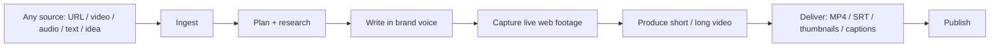

## Target Architecture (serving track — deferred to P2/P4)

This is the **target** for the serving track, research-backed and detailed in docs/hld.md + docs/lld.md. What is built **today (P0–P1.5)** is the pipeline core only — the `python/` uv workspace plus `skills/`, `prompts/`, `templates/`, `config/`, `docs/`, `deploy/`. The `apps/`, `services/`, `workers/` packages in the diagram land in P2/P4.

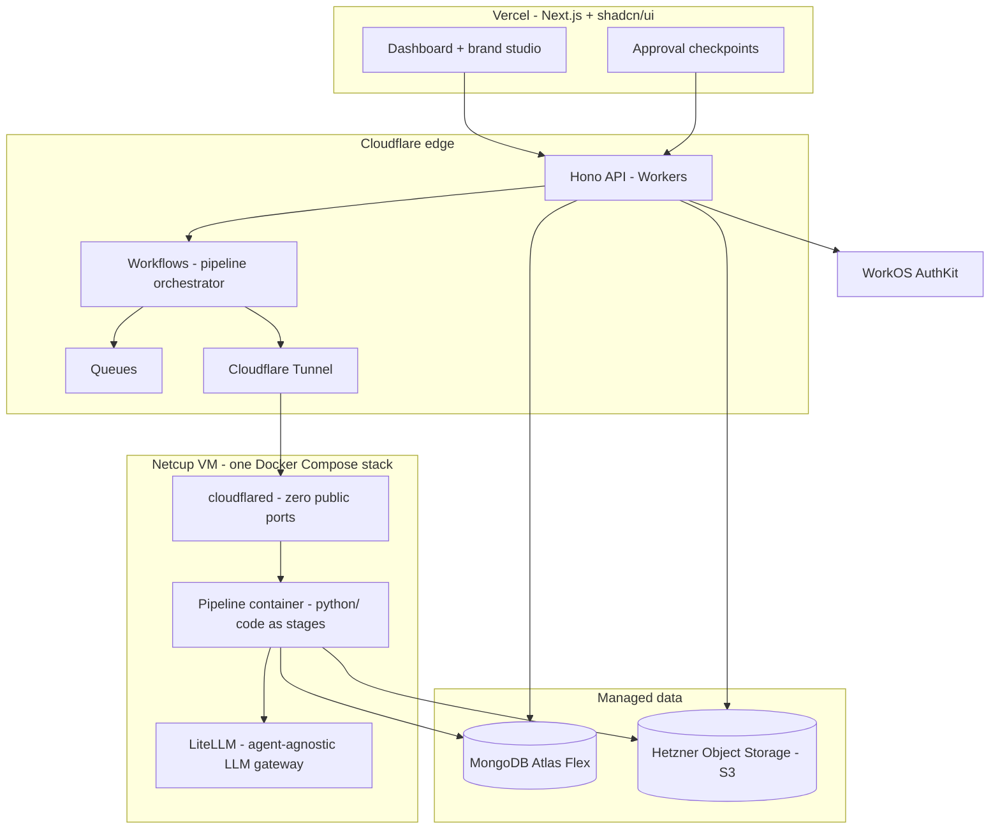

## Dynamic Model

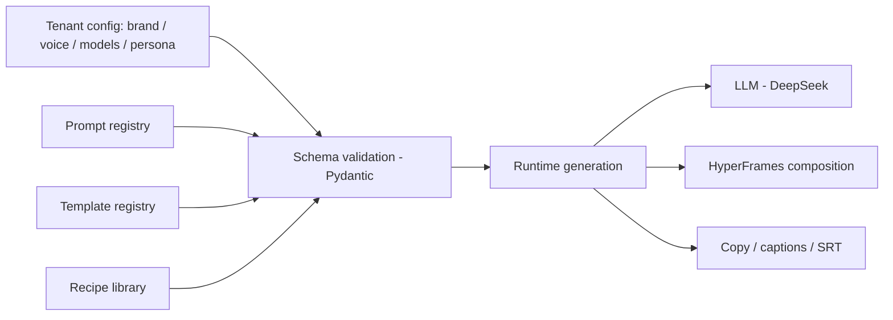

Nothing per-video is hardcoded. A tenant is a validated config blob; the pipeline reads config + registries and generates the composition, copy, and capture recipes at runtime.

## Run input modes — all four supported

The product accepts any of four inputs on a run; every mode converges on
the same edit/compose/render core. `input.kind` only chooses where the run
enters the pipeline, so supporting a mode is config, never new pipeline code.

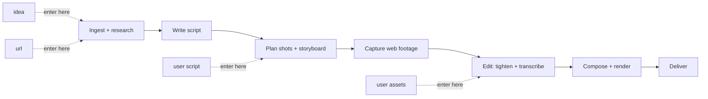

| Mode | Customer gives | Run enters at | Notes |
|---|---|---|---|
| idea | a topic | research / write | fully generated; approvals at checkpoints |
| url | a source URL | ingest / research | research grounded in the URL's material |
| script | their final script (or direction) | plan shots | `script.source = user | hybrid`; visuals from web capture or their assets |
| assets | footage / clips (plus optional script or direction) | edit | tighten + transcribe their media; brand + format from tenant config |

Phasing: P1 makes this data-driven (`RunInput` in the config schema), P1.5
proves script- and assets-modes on fixtures, P2 wires real asset upload
(Hetzner OBJ presigned PUT), P4 adds the customer-facing intake UI.

## Render Tier

Research-verified: Cloudflare Workers cannot encode video (5 min CPU ceiling, 128 MB isolates) and Cloudflare Browser Run cannot record video (screenshots/PDF only). Rendering and capture both run on the **Netcup VM**; everything else is Cloudflare.

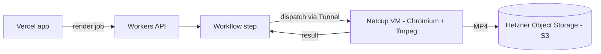

| Option | Role | Verdict |
|---|---|---|
| Vercel | Next.js app, dashboard, brand studio | Use for the web app (P4) |
| Cloudflare Workers | API, Workflows, Queues, Tunnel | Primary platform (P2) |
| Cloudflare Browser Run | Edge browser | Not for video (no recording) — capture stays on the VM Playwright |
| Netcup VM | Pipeline + render container (Chromium + ffmpeg), one Docker Compose stack | Primary compute (P2) |
| Cloudflare Containers | CF-native container runtime | Watch — burst path for the VM (same image) |

Run state: MongoDB Atlas Flex (document-shaped). Media: Hetzner Object Storage (S3 API). See Decided Stack below.

## Roadmap

Pipeline-correctness spine first, serving deferred. P0–P1.5 are the only phases that touch pipeline code. P2 starts **only when the P1.5 proof gate is green**, and its infra shape is re-decided at P2 start using real per-stage telemetry (durations, resource use, failure modes) from P1.5 — not guessed up front. P3 (multi-tenant) and P4 (web app) can partially overlap after P2.

```mermaid
flowchart TD
    P0[P0 Consolidation + green baseline] --> P1[P1 Dynamic config layer]
    P1 --> P15[P1.5 Pipeline hardening - proof gate]
    P15 -. only when the P1.5 gate is green .-> P2[P2 API + VM pipeline services]
    P2 --> P3[P3 Multi-tenant]
    P2 --> P4[P4 Web app]
    P3 --> P4
    P4 --> P5[P5 Productize]
```

Each phase below carries a small state diagram. Canonical phase detail (audit A1–A12, ACs, decision register) lives in `.qwen/plans/plan.md`.

---

## P0 — Consolidation + green baseline

Merge both source repos into the `contentforge` uv workspace; resolve duplication; every script runs from one place.

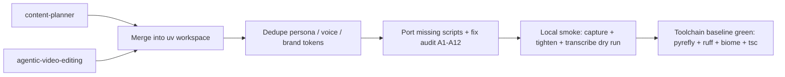

Layout today (P0): `python/`, `skills/`, `prompts/`, `templates/`, `config/`, `docs/`, `deploy/`. No `apps/` / `services/` / `workers/` yet — those are serving-track packages and land in P2/P4.

- `python/` — agents + services + scripts ported from both repos
- `config/persona.yaml` — one persona; one voice/caption ruleset; brand tokens (obsidian / alabaster / gold / silent_gray) as config
- Missing scripts ported: `build_thumbnails.py`, `verify_pip.py`, `audit_pip_collisions.py`, `tighten_words.py`
- Hardcoded source-repo paths replaced by config settings; unified deps in `python/pyproject.toml`; unified `.env.example`

Acceptance criteria:
- Every script from both pipelines runs from `contentforge`
- Zero cross-repo absolute paths; one persona, one voice ruleset, one brand token source
- Local smoke test (capture + tighten + transcribe dry run) exits 0 — CI wiring lands in P2
- Toolchain baseline green: `make verify` (ruff + pyrefly + biome + tsc + pytest)

## P1 — Dynamic config layer

Everything becomes data: tenant config, prompts, templates, recipes.

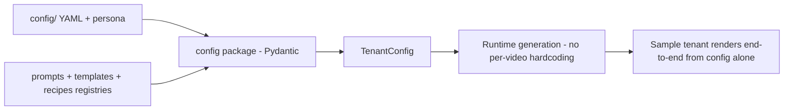

Steps:
1. `config/` schema package (Pydantic): `TenantConfig` (brand tokens, fonts, voice, persona, models), `PromptRef`, `TemplateRef`, `RecipeRef` with strict validation and clear errors
2. Prompt registry: versioned, loadable by name (extend existing `prompts/registry.yaml` pattern)
3. Template registry: HyperFrames templates as data; scenes generated from config + LLM — no per-video hardcoded markup
4. Recipe library: capture recipes as data; LLM generates a recipe from a URL/script
5. Config overrides + fail-fast validation

Acceptance criteria:
- New tenant = new validated config blob, zero code changes
- Invalid config rejected with actionable errors
- Sample tenant renders a demo video end-to-end from config alone

## P1.5 — Pipeline hardening: correct, not just runnable

A single demo video is a milestone, not proof. This pass makes the pipeline provably correct and repeatable **before** anything serves it. (P1.5 is the proof gate for P2.)

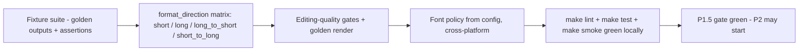

- Fixture suite: checked-in synthetic + real fixtures per stage with golden outputs (tightened transcript, SRT, captions, thumbnail) and deterministic assertions — not just "exit 0"
- Prove reconstructed scripts against fixtures: `tighten_words.py`, `verify_pip.py`, `audit_pip_collisions.py`, `build_thumbnails.py`
- Editing-quality gates: word-boundary tightening, SRT/captions aligned to the tightened timeline, brand tokens from config never from code
- Font policy: resolve fonts from config with cross-platform fallback; kill `/System/Library/Fonts` assumptions
- Golden render: P1 sample-tenant render checked in; regenerate-diff catches silent regressions

Acceptance criteria: fixture suite green; `format_direction` matrix proven; golden render reproducible from config alone; zero hardcoded per-video content.

## P2 — API + VM pipeline services

Edge API on Workers (Hono); pipeline on the Netcup VM; Workflows orchestrates via Tunnel. Full detail: docs/lld.md.

**Gate:** starts only after the P1.5 AC is green. Infra shape is re-decided at P2 start with real P1.5 telemetry.

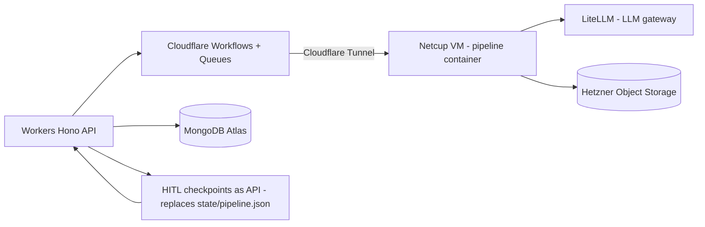

Steps:
1. Workers API (Hono + Zod + mongoose): /runs, /projects, /tenant/config, /media, HITL approve/reject — WorkOS JWT at the edge, MongoDB-backed
2. Cloudflare Workflows + Queues orchestrate runs (durable steps, step.waitForEvent at HITL checkpoints, format_direction branch)
3. MongoDB Atlas (mongoose): tenants, projects, runs, jobs, meters — schema per docs/lld.md
4. Hetzner Object Storage (S3 API) media with per-tenant prefixes + signed URLs
5. Netcup VM Docker Compose stack: pipeline container (FastAPI entrypoints reusing existing python/ code), LiteLLM container, cloudflared — zero public ports
6. LiteLLM: agent-agnostic LLM layer, per-tenant virtual keys, hosted + BYOK
7. HITL checkpoints as API endpoints — replaces state/pipeline.json
8. Asset upload (assets mode): presigned PUT /media/*; POST /runs accepts `input.kind` = idea / url / script / assets and optional script text or direction

Acceptance criteria:
- Full pipeline runs headless via API with job status tracking, all format_direction values
- HITL approvals flow through the API
- Artifacts land in Hetzner OBJ; run state survives restarts in MongoDB

## P3 — Multi-tenant layer

WorkOS orgs + per-tenant isolation + metering.

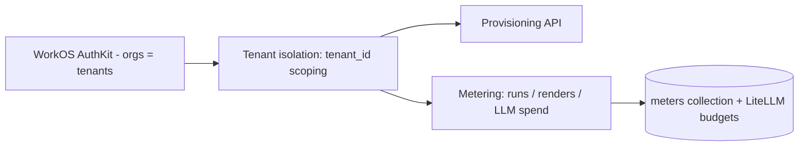

Steps:
1. Auth: WorkOS AuthKit — orgs = tenants, RBAC roles, MFA, social login (1M MAU free)
2. Tenant isolation: MongoDB queries scoped by tenant_id, OBJ prefixes, LiteLLM virtual key per tenant
3. Tenant provisioning API (WorkOS org + config blob + OBJ prefixes + LiteLLM key)
4. Usage metering: runs, renders, LLM spend via LiteLLM budgets + meters collection

Acceptance criteria:
- Two tenants never share data or config
- Provisioning via API; usage recorded per tenant

## P4 — Web app (Next.js + shadcn/ui on Vercel)

The dashboard is the product face.

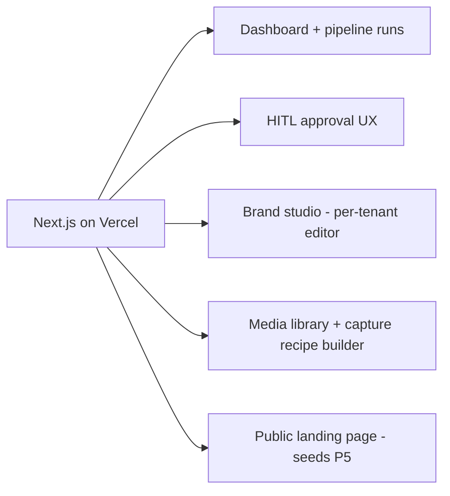

Steps:
1. Next.js app, Tailwind `@theme` brand tokens (obsidian / alabaster / gold / silent_gray)
2. Dashboard: projects, pipeline runs, HITL approval UX, render queue + download
3. Brand studio: per-tenant editor for brand, voice, templates, recipes, models
4. Media library + capture recipe builder
5. Public landing page (seed for P5)
6. Per-run intake UI: start from an idea / URL, paste a script or direction, or upload assets

Acceptance criteria:
- User runs a full pipeline from the browser
- Approve/reject at checkpoints; download deliverables
- Brand studio changes take effect on the next run without code changes

## P5 — Productization

Sell it.

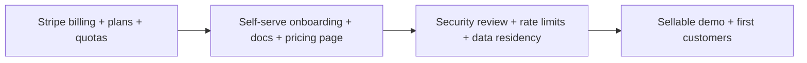

Steps:
1. Billing: Stripe, plans + quotas, usage-based pricing
2. Onboarding, docs, pricing page, public site
3. Security review, rate limits, data residency
4. Sellable demo + first customers

Acceptance criteria:
- Self-serve onboarding; billing accurate
- Security review clean; sellable demo

---

## Decided Stack (research-backed 2026-08-31)

| Decision | Choice | Why |
|---|---|---|
| Monorepo tooling | uv workspace | Modern, fast; both repos are plain venv today |
| Auth | WorkOS AuthKit | 1M MAU free; orgs + RBAC + MFA built in |
| Public API | Cloudflare Workers + Hono (TypeScript) | Edge auto-scale; Python on Workers is beta |
| Orchestration | Cloudflare Workflows + Queues | Durable steps; replaces Celery/Redis entirely |
| Database | MongoDB Atlas Flex (managed) | No infra overhead (solo founder); document-shaped state per db_design.md |
| Object store | Hetzner Object Storage (S3) | 1 TB storage + 1 TB egress included; EU; free ingress |
| LLM gateway | LiteLLM proxy (SQLite, on VM) | Agent-agnostic; per-tenant keys + budgets; BYOK; MIT |
| Compute | Netcup VM — one Docker Compose stack | Already owned, cheap, no cold starts; pipeline + renders + LiteLLM |
| VM reachability | Cloudflare Tunnel | Zero public ports |
| Burst path | Cloudflare Containers (same image) | Config swap, not rewrite |
| Web | Vercel + Next.js + shadcn/ui | Existing deferred dashboard plan |
| MVP | Full pipeline, dynamic format_direction + all input modes | short / long / long_to_short / short_to_long; every run starts from idea, url, script, or assets — user picks (build_shorts.py exists) |
| Billing (P5) | Stripe | Standard |
| Errors / observability | Sentry + Arize OTEL + CF Web Analytics + UptimeRobot | Existing Arize wiring reused |
| Docs (P4+) | Mintlify | Instant docs site |

**Launch cost: ~10-20/mo** (free-tier-first: Vercel Hobby, CF free tier, Atlas M0 dev; paid tiers only when real usage arrives). Back-of-envelope capacity + scaling limits: **[docs/capacity.md](docs/capacity.md)**.

**Remaining open:** pricing model (per-render credits vs seats), product branding/domain, WorkOS custom auth domain ($99/mo — defer). VM is Netcup VPS 1000 G12 (4 vCPU / 8 GB, verified) — render queue throttled to 1 concurrent.
