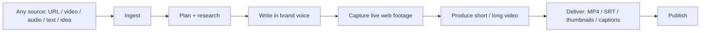
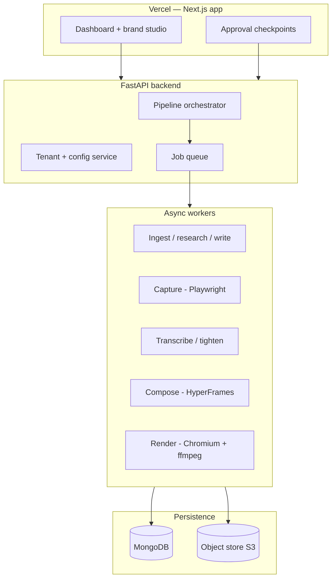
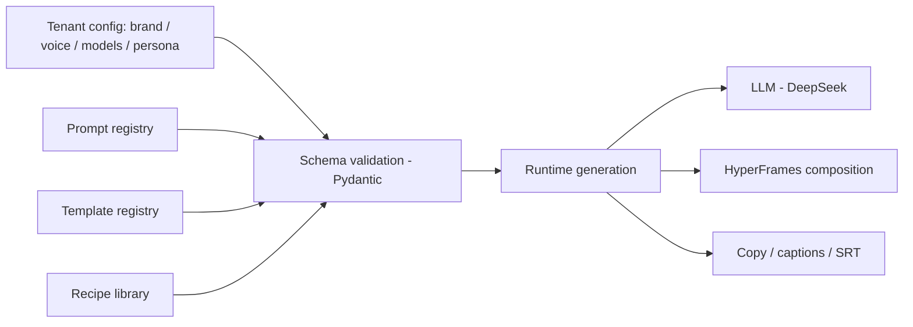
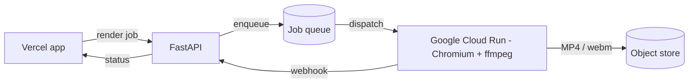
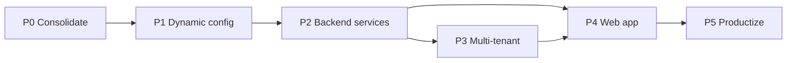

# ContentForge — Agentic Content Production SaaS

Merge of `content-planner` (planning: ingest, research, script, capture) + `agentic-video-editing` (production: tighten, transcribe, compose, render, deliver) into one sellable, fully dynamic, multi-tenant platform.

**Fully dynamic** = everything is generated at runtime from validated config + LLM (prompts, templates, scenes, recipes — nothing hardcoded per video) **and** customers customize brand, voice, and templates per tenant.

## Product Pipeline

## Target Architecture

## Dynamic Model

Nothing per-video is hardcoded. A tenant is a validated config blob; the pipeline reads config + registries and generates the composition, copy, and capture recipes at runtime.

## Render Tier

Neither Vercel nor Cloudflare Workers can run Chromium/ffmpeg renders. Vercel hosts the app; renders run on HyperFrames' native cloud target.

| Option | Role | Verdict |
|---|---|---|
| Vercel | Next.js app, dashboard, brand studio | Use for the web app |
| Cloudflare Workers | Edge runtime, no Chromium | Not for rendering; optional edge caching later |
| Google Cloud Run | HyperFrames `cloudrun` target: Docker + Chromium + ffmpeg, scale-to-zero, long timeouts | Primary render workers |
| AWS Lambda | HyperFrames `lambda` target (Remotion-Lambda pattern) | Alternative render backend |

## Roadmap

P0-P2 are the foundation and must land in order. P3 (tenant isolation) and P4 (dashboard) can partially overlap after P2.

---

## P0 — Consolidation (monorepo)

Merge both repos into `contentforge`; resolve duplication; everything runs from one place.

Steps:
1. Monorepo layout: `apps/web/`, `services/api/`, `workers/`, `python/` (agents + scripts from both), `skills/`, `prompts/`, `templates/`, `config/`, `docs/`
2. Move `content-planner`: `skill/` (v2.1.0), `scripts/` (ingest, diagram, board, workspace, capture, transcribe, tighten, slice, gen_captions, audio_master, build_shorts, serve_teleprompter), `library/` + `outputs/` + `calendar/` + `workspace/` as gitignored data dirs
3. Move `agentic-video-editing`: `skills/video-agent` (v1.1.2), `python/agents`, `python/services`, `python/config/settings.py`, `templates/`, `prompts/`, `docs/`
4. Dedupe: one `config/persona.yaml` (merge content-planner `skill/persona.yaml` + video root `persona.yaml`), one voice/caption ruleset, brand tokens as config (obsidian / alabaster / gold / silentGray)
5. Reconcile missing scripts referenced by video-agent but absent here: `build_thumbnails.py`, `verify_pip.py`, `audit_pip_collisions.py`, `tighten_words.py` (port from content-planner)
6. Replace hardcoded `/Users/noahsheldon/Documents/Work_Projects/content-planner` path in `skills/video-agent/SKILL.md` with a config setting
7. Unified `requirements.txt` + `.env.example` (DEEPSEEK_API_KEY, ARIZE, X_BEARER_TOKEN, OPENAI_API_KEY, PIXABAY)

Acceptance criteria:
- Every script from both pipelines runs from `contentforge` (tighten, capture, transcribe, board-sync, render)
- Zero cross-repo absolute paths
- One persona, one voice ruleset, one brand token source
- CI smoke test: capture + tighten + transcribe dry run exits 0

## P1 — Dynamic config layer

Everything becomes data: tenant config, prompts, templates, recipes.

Steps:
1. `config/` schema package (Pydantic): `TenantConfig` (brand tokens, fonts, voice, persona, models), `PromptRef`, `TemplateRef`, `RecipeRef` with strict validation and clear errors
2. Prompt registry: versioned, loadable by name (extend existing `prompts/registry.yaml` pattern)
3. Template registry: HyperFrames templates as data; scenes generated from config + LLM — no per-video hardcoded markup
4. Recipe library: capture recipes as data; LLM generates a recipe from a URL/script
5. Config overrides + fail-fast validation

Acceptance criteria:
- New tenant = new validated config blob, zero code changes
- Invalid config rejected with actionable errors
- Sample tenant renders a demo video end-to-end from config alone

## P2 — Backend services (FastAPI)

Expose the pipeline as an API with async jobs.

Steps:
1. FastAPI app: `/ingest` `/plan` `/research` `/capture` `/transcribe` `/tighten` `/compose` `/render` `/deliver`
2. Job queue + async workers (Celery + Redis vs arq — ADR)
3. Persistence: MongoDB per `docs/db_design.md` (ADR: Mongo vs Postgres)
4. Object store: S3-compatible for media + renders
5. HITL checkpoints as API endpoints (approve / reject / resume) — replaces `state/pipeline.json`
6. ADRs: queue, DB, storage, render infra

Acceptance criteria:
- Full pipeline runs headless via API with job status tracking
- HITL approvals flow through the API
- Artifacts land in object store; job state survives restarts

## P3 — Multi-tenant layer

Isolation, auth, metering.

Steps:
1. Auth: orgs/tenants + users + API keys (provider ADR: Supabase Auth vs Auth0 vs custom)
2. Tenant isolation: config, media, jobs, renders, meters
3. Tenant provisioning API
4. Usage metering: jobs, render minutes, credits

Acceptance criteria:
- Two tenants never share data or config
- Provisioning via API; usage recorded per tenant

## P4 — Web app (Next.js + shadcn/ui on Vercel)

The dashboard is the product face.

Steps:
1. Next.js app, Tailwind `@theme` brand tokens (obsidian / alabaster / gold / silentGray)
2. Dashboard: projects, pipeline runs, HITL approval UX, render queue + download
3. Brand studio: per-tenant editor for brand, voice, templates, recipes, models
4. Media library + capture recipe builder
5. Public landing page (seed for P5)

Acceptance criteria:
- User runs a full pipeline from the browser
- Approve/reject at checkpoints; download deliverables
- Brand studio changes take effect on the next run without code changes

## P5 — Productization

Sell it.

Steps:
1. Billing: Stripe, plans + quotas, usage-based pricing
2. Onboarding, docs, pricing page, public site
3. Security review, rate limits, data residency
4. Sellable demo + first customers

Acceptance criteria:
- Self-serve onboarding; billing accurate
- Security review clean; sellable demo

---

## Open Decisions

- DB: MongoDB (per db_design.md) vs Postgres
- Queue: Celery + Redis vs arq (Redis)
- Auth: Supabase Auth vs Auth0 vs custom
- Monorepo tooling: uv / Poetry / plain venv
- Pricing model: per-render credits vs seats vs usage
- Product branding: ContentForge name, domain, public identity
