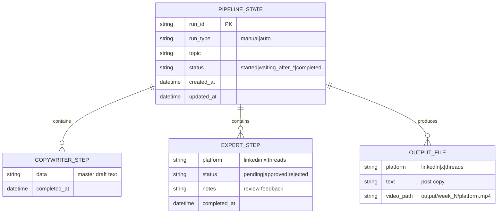
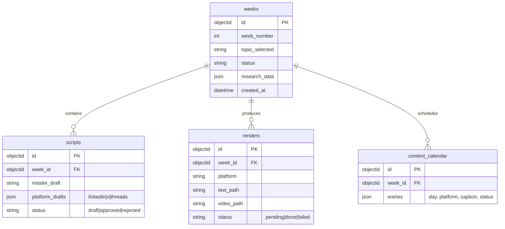

# Database Design (Updated July 2026)

## V1: JSON State File (No Database)

```json
{
  "run_id": "run_20260725_120000",
  "run_type": "manual",
  "topic": "Building RAG at Scale",
  "status": "waiting_after_copywriter",
  "steps": {
    "copywriter": {
      "data": "I built a RAG pipeline. Here is what worked...",
      "completed_at": "2026-07-25T12:00:00"
    },
    "linkedin_approved": {
      "data": "Adapted LinkedIn post...",
      "completed_at": "2026-07-25T12:02:00"
    }
  },
  "output": {
    "linkedin": {
      "text": "I spent 6 months building RAG at Fitch...",
      "video_path": "output/week_30/linkedin.mp4"
    }
  },
  "created_at": "2026-07-25T12:00:00",
  "updated_at": "2026-07-25T12:05:00"
}
```

### Storage Map



## V2: MongoDB (When Dashboard Is Built)


