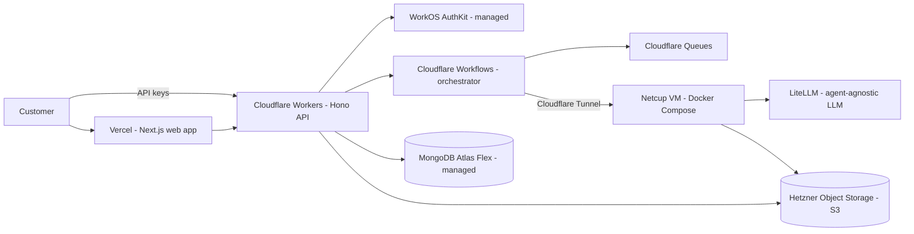
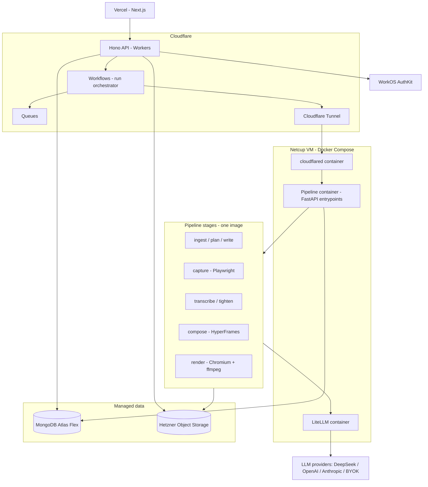
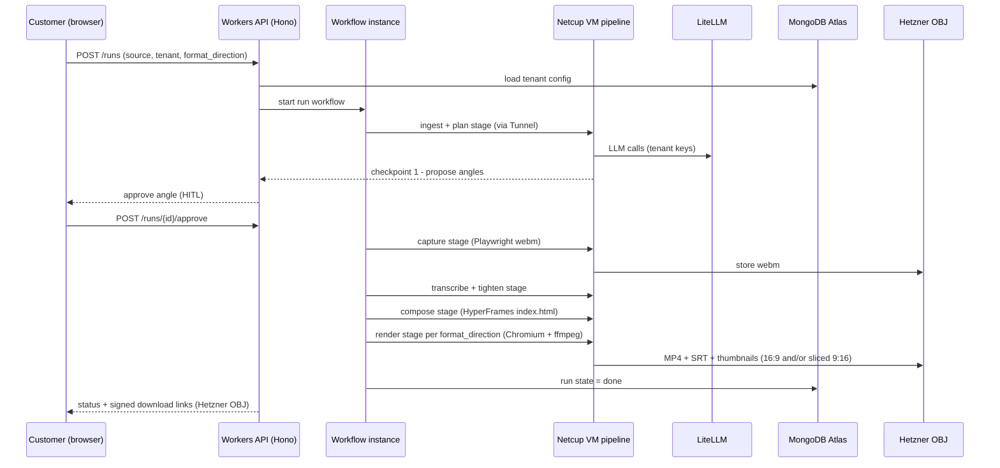
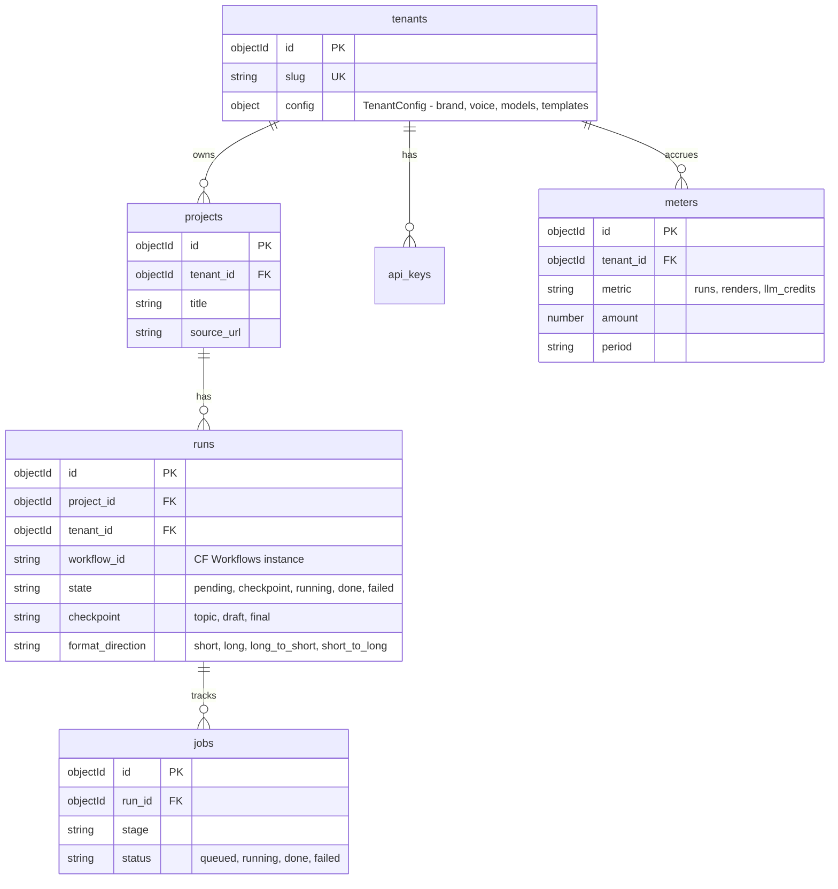
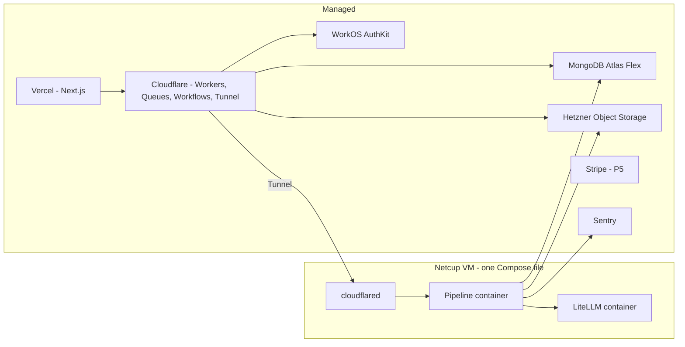

# ContentForge — High-Level Design

Sellable, fully dynamic, multi-tenant content production SaaS. Cloudflare edge + one Netcup VM + managed services only. Low cost, fast to market, minimal infra overhead for a part-time solo founder.

> Scope: this design is the **target architecture for the serving track (P2–P5)**.
> Today (P0–P1.5) the repo holds the `python/` pipeline core only; P2 builds the
> components below on top of it. Current-state diagrams: PLAN.md Roadmap /
> `.qwen/plans/plan.md`.

## 1. System Context

## 2. Architecture Decisions

| Component | Choice | Why |
|---|---|---|
| Web app | Next.js + shadcn/ui on Vercel | Existing deferred dashboard plan; managed |
| Auth | WorkOS AuthKit | 1M MAU free; orgs + RBAC + MFA built in; zero auth infra |
| Public API | Cloudflare Workers + Hono (TypeScript) | Edge auto-scale; Python on Workers is beta |
| Orchestration | Cloudflare Workflows + Queues | Durable steps, retries, waitForEvent HITL; replaces Celery/Redis |
| Database | MongoDB Atlas Flex (managed) | No infra overhead (solo founder requirement); usage-based $8-30/mo; document-shaped state matches db_design.md |
| Object storage | Hetzner Object Storage (S3-compatible) | Base price includes 1 TB storage + 1 TB egress; EU regions; free ingress; S3 API = portable |
| LLM gateway | LiteLLM proxy on the VM (SQLite backend) | Agent-agnostic; per-tenant virtual keys + budgets; BYOK; MIT; one container |
| Compute | Netcup VM — one Docker Compose stack | Already owned, cheap, no cold starts; runs pipeline + renders + LiteLLM |
| VM reachability | Cloudflare Tunnel | Zero inbound ports, no public IP exposure, no NAT pain |
| Burst path | Cloudflare Containers (same image) | Portability means CF-native burst is a config swap, not a rewrite |
| Transcription | faster-whisper (CPU, on VM) | Package; fine on 4-6 cores |
| Capture | Playwright (on VM) | Browser Run cannot record video (verified) |
| Errors / observability | Sentry + Arize OTEL + Cloudflare Web Analytics + UptimeRobot | Packages; existing Arize wiring reused |
| Billing (P5) | Stripe | Standard |
| Docs (P4+) | Mintlify | Instant docs site |

## 3. Component Diagram

## 4. One Run, End to End

## 5. Data Model (MongoDB Atlas)

Driver: `mongoose` (API) + `pymongo` (pipeline). All queries scoped by `tenant_id`. Media keys in Hetzner OBJ: `tenants/{tenant_id}/{project_id}/{run_id}/{artifact}`. Migration path if Atlas outgrows: standard MongoDB drivers, no vendor lock beyond the driver.

## 6. Deployment Topology

One VM, one `compose.yaml` (pipeline + LiteLLM + cloudflared). Everything else is a managed service or the Cloudflare edge. Nightly Mongo backups: `mongodump` → Hetzner OBJ (cron on the VM). The pipeline image is plain Dockerfile → portable to Cloudflare Containers / Cloud Run for burst or failover.

## 7. Cost Shape (launch)

Free-tier-first: build on free tiers, pay only when real usage arrives.

| Line item | Free tier | Paid (when needed) |
|---|---|---|
| Vercel | Hobby — free (personal) | Pro 20/mo |
| Cloudflare | Free — 100k req/day, Workers + Queues | Paid 5/mo |
| MongoDB Atlas | M0 — 512 MB, dev only | Flex 8-30/mo (production) |
| Hetzner Object Storage | n/a — base ~2-3/mo (1 TB incl.) | ~2-3/mo |
| Netcup VM (VPS 1000 G12, owned) | 4 vCPU / 8 GB — 10.37/mo | 10.37/mo |
| WorkOS | 1M MAU free | 0 |
| LiteLLM | MIT, on VM | 0 |
| LLM inference | usage (DeepSeek is cheap) | usage |
| **Launch total** | **~10-20/mo** (VM + Hetzner + CF free) | ~25-70/mo + inference |

Cost discipline: DeepSeek `deepseek-v4-flash` as the default hosted model keeps inference cents-level; R2-style free egress is not available on Hetzner (1 TB included, ~EUR 1/TB after) — monitor the first month of delivery traffic; the VM consolidates compute so there is no per-render cloud bill.

Numbers + scaling limits (VM throughput, API free ceiling, OBJ
storage/egress, LLM $/day): **[docs/capacity.md](docs/capacity.md)** —
re-run at the P2 gate with real P1.5 per-stage telemetry.

## 8. Non-Functional

- **Security**: WorkOS JWTs verified at the edge (JWKS); VM has zero public ports (Cloudflare Tunnel); tenant isolation via tenant_id scoping + OBJ prefixes + signed URLs; secrets in env/Secrets Store, never in images; LiteLLM encrypts BYOK keys.
- **Isolation**: tenant config, media, runs, meters scoped per tenant; API keys per tenant.
- **Metering**: LiteLLM virtual keys track LLM spend; runs/jobs counted in Mongo; Stripe metered billing in P5.
- **Observability**: Arize OTEL (LLM traces), Sentry (errors), UptimeRobot (VM/API uptime), Cloudflare analytics, LiteLLM usage logs.
- **Scaling**: edge auto-scales; the VM is the fixed compute ceiling (see Known Risks); Atlas/Hetzner scale independently; burst = Cloudflare Containers with the same image.

## 9. Known Risks (self-review, 2026-08-31)

1. **Single VM = single point of failure.** The whole production brain lives on one host. Mitigation: portability to Cloudflare Containers (config swap), nightly Mongo backups to Hetzner OBJ (RPO ≤ 24h), Netcup COW snapshots included, `compose up` rebuild from image. Acceptable at launch; revisit before paying customers.
2. **Concurrency ceiling.** VM = 4 vCPU / 8 GB (Netcup VPS 1000 G12, verified). Chromium + ffmpeg per render needs ~3-4 GB → usable headroom ≈ 5-6 GB → **1 concurrent render (throttle queue to 1), 2 max with lighter jobs**. A 30-200s render ≈ 3-5 min wall → a few renders/hour at launch. Fine for early customers; burst = Cloudflare Containers (same image). Render queue concurrency is a config value, sized to the VM.
3. **Workflows → VM connectivity** depends on Cloudflare Tunnel being a first-class component (it is in this design). Tunnel adds one moving part and ~30-80ms hop; acceptable.
4. **Hetzner egress is not free** (unlike R2): 1 TB/mo included, then ~EUR 1/TB. A 100 MB MP4 x 10k downloads = 1 TB. Monitor; still cheap, and the free ingress + S3 API calls keep uploads at zero.
5. **LiteLLM on SQLite** = single-instance key admin. Fine on one VM; Postgres upgrade only if the proxy becomes a bottleneck.
6. **The product risk is output quality, not infra.** LLM-generated scenes can drift from brand consistency. Mitigation: template registry constrains the LLM; review gates (VERDICT PASS/FAIL) become code; golden-sample regression checks in CI.
7. **Part-time timeline.** P0-P5 is 8-14 weeks of evenings. Phase gates on the board (each with acceptance criteria) keep scope honest; P0-P2 are the sequential foundation.

## 10. Coupling strategy

Couple by contract, not by code: tight inside each component, loosely
coupled between them, every seam through a typed contract or
vendor-neutral interface. Detail: architecture.md §8.

| Seam | Decoupled by |
|---|---|
| Pipeline stages | one CLI per stage; IO as files + `RunConfig` |
| Agents | Pydantic contracts + ABCs |
| Content vs behavior | prompts / templates / recipes registries |
| LLM | LiteLLM proxy |
| Storage | S3 API behind presigned URLs |
| Auth / orgs | WorkOS AuthKit |
| Web vs core | Hono REST API |

Two rules before P2: (1) compute behind an **executor seam** — same
pipeline image runs on the Netcup VM or Cloudflare Containers as a config
swap; (2) run metadata in MongoDB, blobs in Hetzner OBJ — never blobs in
the DB, never DB-shaped state in files.

Keep tight: one Docker Compose stack on the VM; shared `python/`
codebase (loose modules, not loose deployment); Workflows is the only
distributed piece (accepted binding, portable image); no event bus
beyond `waitForEvent` at HITL checkpoints.

## 11. Out of Scope (later)

SAML SSO + custom auth domain (WorkOS add-ons), multi-region, public API SDK, Cloudflare Containers production rollout (burst path today), auto-scaling beyond one VM.
