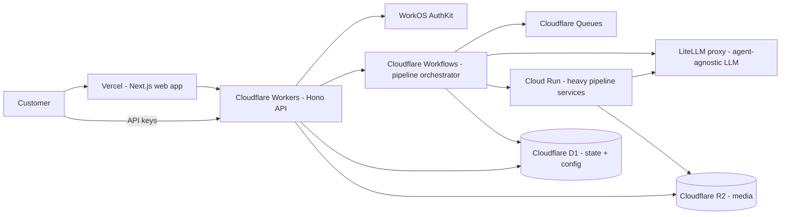
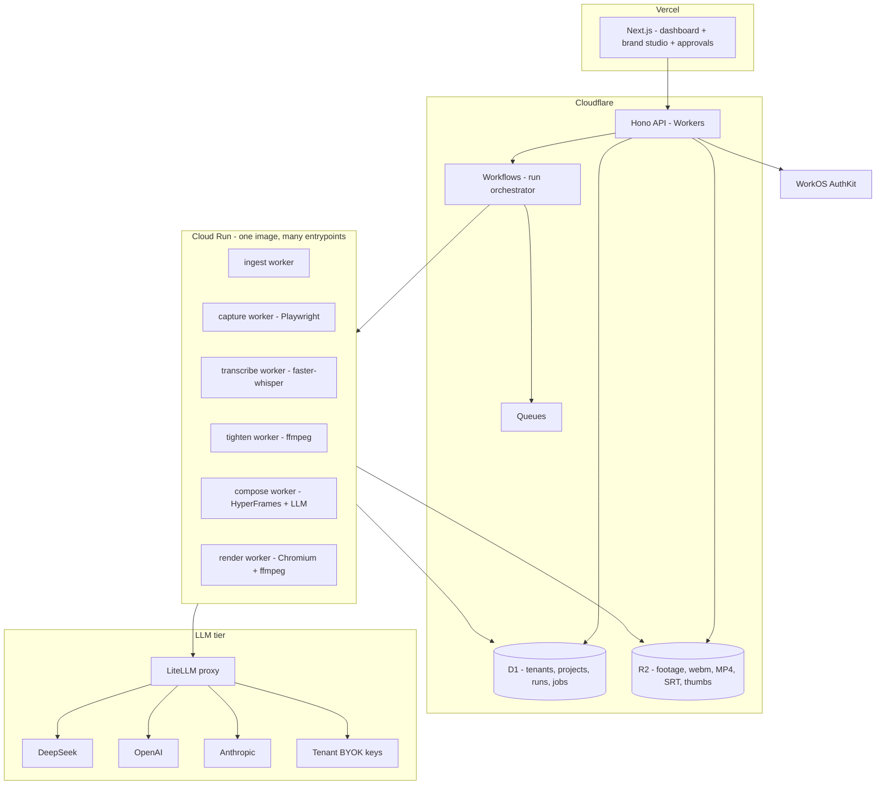
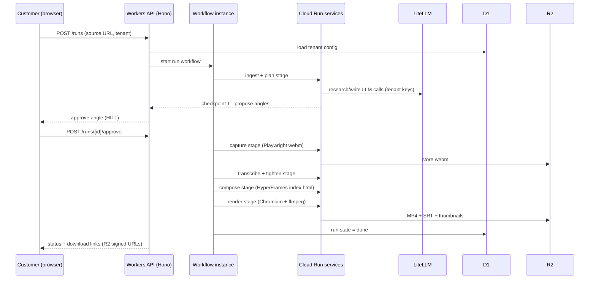
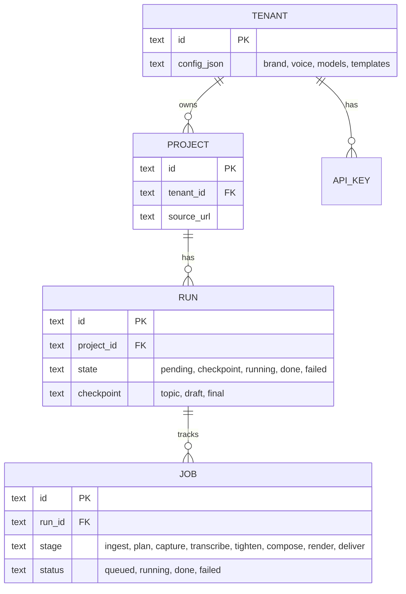

# ContentForge — High-Level Design

Sellable, fully dynamic, multi-tenant content production SaaS. Cloudflare-first, managed services only, low cost, fast to market.

## 1. System Context



## 2. Architecture Decisions

| Component | Choice | Why (research-backed) |
|---|---|---|
| Web app | Next.js + shadcn/ui on Vercel | Matches existing deferred dashboard plan; best-in-class DX |
| Auth | WorkOS AuthKit | 1M MAU free, built-in orgs + RBAC + MFA; no tenant infra to build |
| Public API | Cloudflare Workers + Hono (TypeScript) | Textbook Worker workload; Python on Workers is beta |
| Orchestration | Cloudflare Workflows + Queues | Durable steps, unlimited wall-clock, retries; replaces Celery/Redis entirely |
| State / tenant config | Cloudflare D1 (SQLite) + Drizzle ORM | $5/mo, 25B reads/mo included; fits document-ish pipeline state |
| Media | Cloudflare R2 | Free egress (deliver MP4s at zero bandwidth cost); S3 API |
| LLM gateway | LiteLLM proxy (self-hosted, one container) | Per-tenant virtual keys + budgets + rate limits; MIT; OpenAI-compatible endpoint = agent-agnostic |
| Heavy workers | Google Cloud Run (one container image) | Only runtime that fits ffmpeg/Playwright/whisper; scale-to-zero, 60 min timeout |
| Video render | Cloud Run (Chromium + ffmpeg) | Verified: Workers CPU ceiling 5 min + 128 MB cannot encode video; Browser Run cannot record |
| Transcription | faster-whisper (CPU, on Cloud Run) | Package exists; no GPU needed at this scale |
| Capture | Playwright (on Cloud Run) | Browser Run is screenshots/PDF only — cannot record webm |
| Web capture recipes | LLM-generated recipes (existing content-planner pattern) | Already built |
| Observability | Arize OTEL (existing) + Cloudflare Web Analytics | Reuse existing tracing; free analytics |
| Errors | Sentry | Package; one-line setup |
| Email (later) | Resend | Package; transactional + delivery notifications |
| Billing (P5) | Stripe | Package; standard |
| Docs (later) | Mintlify | Package; instant docs site |
| Video previews (P4) | Cloudflare Stream | In-app preview playback without MP4 download |

## 3. Component Diagram



## 4. One Run, End to End



## 5. Data Model Overview



State lives in D1 (SQLite). Heavy artifacts (media) live in R2 referenced by key. Workflow step state is ephemeral; the run record is the source of truth.

## 6. Deployment Topology

```mermaid
flowchart LR
    subgraph Vercel
        WEB[Next.js app]
    end
    subgraph Cloudflare
        WK[Workers + D1 + R2 + Queues + Workflows]
    end
    subgraph GCP[Google Cloud - one project]
        CR[Cloud Run service - pipeline container]
        LP[Cloud Run service - LiteLLM container]
    end
    subgraph Managed
        WO[WorkOS AuthKit]
        ST[Stripe]
        SN[Sentry]
    end
    WEB --> WK
    WK --> CR
    CR --> LP
    WK --> WO
    CR --> SN
    LP --> ST "metering hooks later"
```

Nothing custom to run: Vercel (managed), Cloudflare (managed), Cloud Run (managed containers, scale-to-zero), WorkOS/Stripe/Sentry (SaaS).

## 7. Cost Shape (post-launch, paid tiers)

| Line item | Est. / mo |
|---|---|
| Vercel (Pro) | 20 |
| Cloudflare (Workers $5 + D1 $5 + R2 + Queues) | 10-15 |
| Cloud Run (pipeline + LiteLLM, scale-to-zero) | 20-60 |
| WorkOS AuthKit (1M MAU free) | 0 |
| LiteLLM | 0 (MIT, self-hosted container) |
| LLM inference (hosted credits) | usage |
| Total infra | ~50-100 + inference |

Free egress on R2 means delivering MP4s costs nothing. Every component is a managed service or a one-container deploy.

## 8. Non-Functional

- **Security**: WorkOS sessions (JWKS-verified JWTs) at the edge; tenant isolation in D1 (tenant_id scoping) and R2 (per-tenant prefixes + signed URLs); LiteLLM encrypts BYOK keys; secrets in Cloudflare Secrets Store.
- **Isolation**: tenant config, media, runs, meters all scoped by tenant_id; API keys per tenant.
- **Metering**: LiteLLM virtual keys give per-tenant spend; runs/jobs counted in D1; Stripe metered billing in P5.
- **Observability**: Arize OTEL for LLM traces (existing), Sentry for errors, Cloudflare analytics for traffic, LiteLLM usage logs.
- **Scale path**: D1 is the first ceiling (SQLite) — migrate to Postgres (Neon/Supabase) if needed; Workers/Workflows scale horizontally by design; Cloud Run scale-to-zero.

## 9. Out of Scope (later)

SAML SSO + custom auth domain (WorkOS paid add-ons), Cloudflare Containers (CF-native Cloud Run replacement, worth watching), public API SDK, multi-region.
