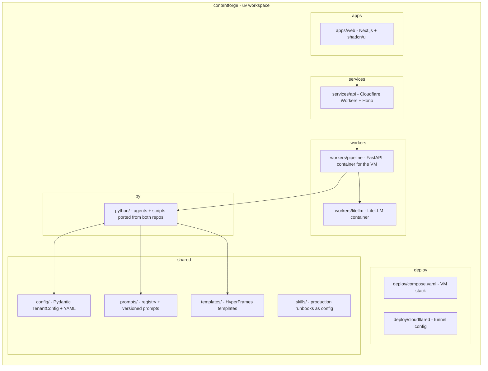
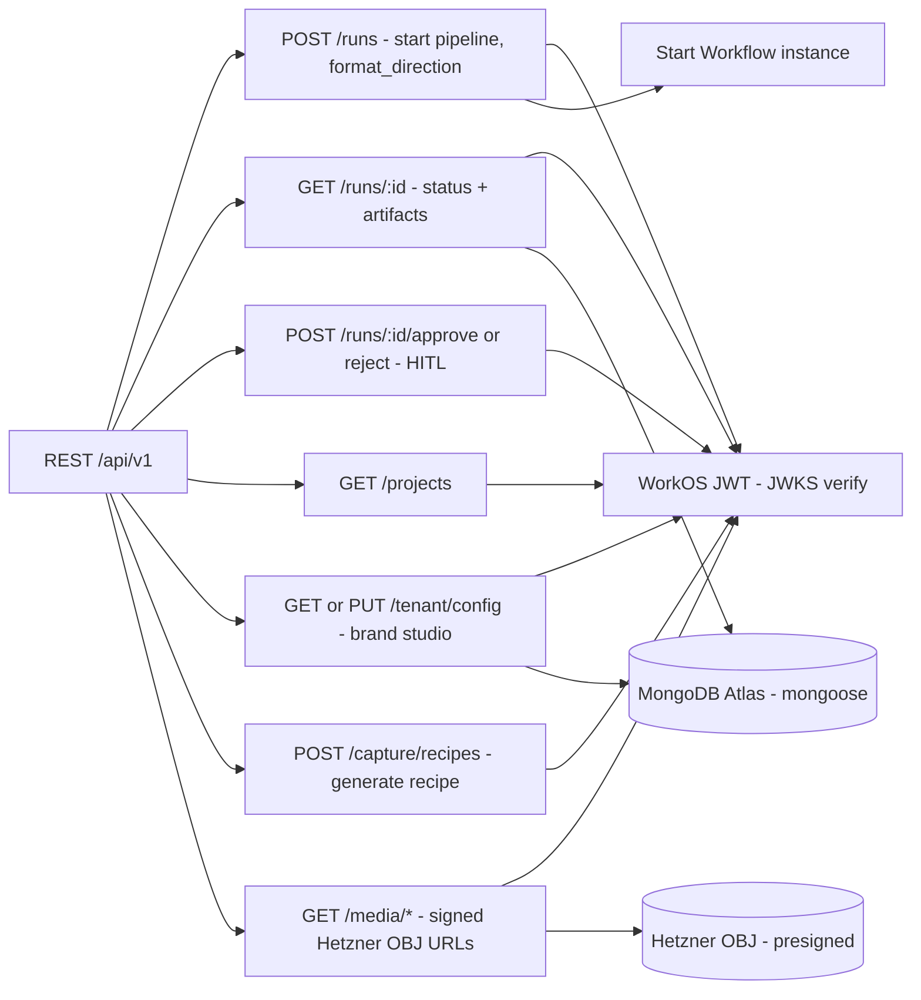
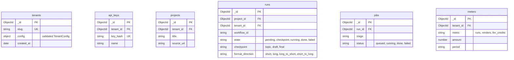
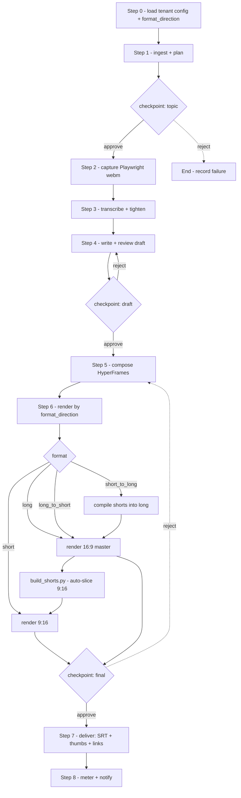
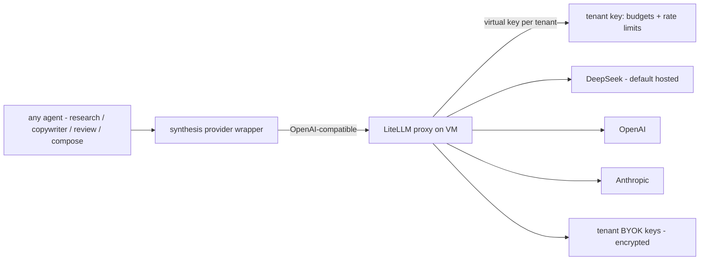
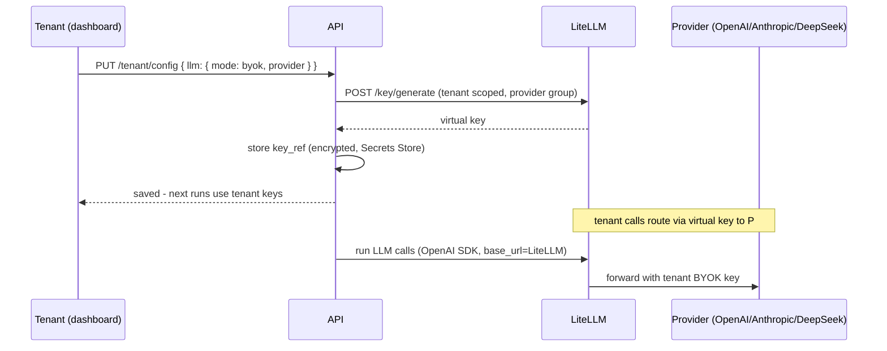
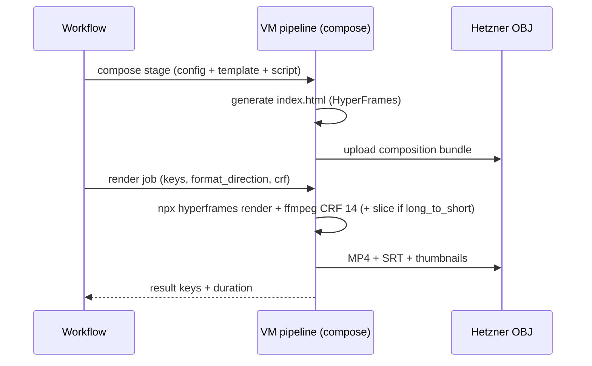

# ContentForge — Low-Level Design

Companion to HLD. Concrete packages, schemas, endpoints, and wiring. Everything is a package or proven existing code; one VM + managed services; cost-first.

> Layout below = **target (P2–P5)**. Current P0 tree is the pipeline core only:
> `python/`, `skills/`, `prompts/`, `templates/`, `config/`, `docs/`, `deploy/`.
> `apps/`, `services/`, `workers/` arrive with P2/P4.

## 1. Monorepo Layout (uv workspace)



Tooling: `uv` workspace; `wrangler` (Workers/Queues/Workflows/Tunnel), `docker compose` (VM), GitHub Actions CI.

## 2. API Surface (Workers + Hono)



Every request: WorkOS JWT verified at the edge, tenant from `org_id` claim, Mongo queries scoped by `tenant_id`, Zod validation.

## 3. Data Model (MongoDB, mongoose)



Indexes: `tenant_id` on every collection; `run_id` on jobs. Media keys in Hetzner OBJ: `tenants/{tenant_id}/{project_id}/{run_id}/{artifact}`. `format_direction` is run-level config — the pipeline branches on it (section 4).

## 4. Pipeline Orchestration (Cloudflare Workflows → VM via Tunnel)



Workflow steps call VM endpoints through the Cloudflare Tunnel (private hostname). Heavy stages (capture/transcribe/render) run on the VM; pure-LLM stages can run in-step via LiteLLM. Step payloads carry keys, not media. **Render concurrency is throttled to 1** (VM: 4 vCPU / 8 GB — VPS 1000 G12; each render needs ~3-4 GB); burst path = Cloudflare Containers with the same image.

## 5. VM Stack (Docker Compose on Netcup)

```yaml
# deploy/compose.yaml - one stack, three services
services:
  pipeline:
    build: ../workers/pipeline        # FastAPI: ingest/plan/capture/transcribe/tighten/compose/render/deliver
    env_file: .env                    # MONGO_URI (Atlas), OBJ_* (Hetzner), LITELLM_URL, DEEPSEEK_API_KEY, ARIZE_*
    volumes: [media-cache:/media]     # scratch for ffmpeg/whisper
  litellm:
    image: ghcr.io/berriai/litellm:main
    command: ["--config", "/app/litellm.yaml"]  # SQLite backend, model groups, virtual keys
    env_file: .env
  cloudflared:
    image: cloudflare/cloudflared
    command: tunnel run contentforge   # zero public ports; exposes pipeline to Workflows
volumes:
  media-cache:
```

- Pipeline image is a plain Dockerfile (portable to Cloudflare Containers / Cloud Run for burst).
- LiteLLM uses its SQLite backend (no Postgres — infra overhead not wanted); one instance is fine on one VM.
- Nightly cron: `mongodump` → Hetzner OBJ; `docker compose pull && up -d` for updates.
- VM hardening: non-root user, UFW default-deny, fail2ban, unattended-upgrades, secrets in `.env` never in images.

## 6. Agent-Agnostic LLM Layer (LiteLLM)



- One virtual key per tenant via `POST /key/generate` (SQLite-backed; master key in `.env`).
- Existing `synthesis/openai.py` wrapper changes only its `base_url` to the LiteLLM endpoint — every agent stays on the OpenAI SDK. Agent-agnostic: no agent knows which provider serves it.
- Hosted mode: tenant key → platform DeepSeek group (metered credits). BYOK mode: tenant key → their provider keys.
- Prompt registry entries can carry `model_family` hints; LiteLLM aliases route per family.

## 7. Tenant Config (Pydantic)

```yaml
# config/tenants/example.yaml - validated by config/ package
tenant:
  id: t_01
  slug: acme
  brand:
    colors: { primary: "#0D1117", accent: "#D4AF37", bg: "#F5F1E8" }
    fonts: ["Playfair Display", "Inter", "JetBrains Mono"]
  voice: "grade 5-6 plain speech, no em-dashes, spoken-flow"
  persona: config/persona.yaml
  llm:
    mode: hosted            # hosted | byok
    provider: deepseek
    model: deepseek-v4-flash
    key_ref: null           # set when mode=byok
  templates: ["short-form/vox", "long-form/documentary"]
  prompts:
    copywriter: v1.1.2
    review: v1.0.3
  formats: ["long_to_short", "short"]   # allowed format_direction values
  recipes: ["table-walkthrough", "json-api-demo"]
```

A new tenant = validated blob + LiteLLM virtual key + OBJ prefixes — zero code. `formats` caps which directions a tenant may request.

## 8. BYOK Flow



## 9. Auth Flow (WorkOS AuthKit)


RBAC: WorkOS roles gate dashboard actions; API trusts token claims. Tenant ↔ WorkOS org: 1:1 at provisioning.

## 10. Render Handoff (VM)



Workers cannot render (CPU ceiling, no ffmpeg — verified). VM runs Chromium + ffmpeg natively; Cloudflare Containers is the burst path with the same image. Signed URLs from Hetzner OBJ deliver at ~EUR 1/TB egress beyond the included 1 TB.

## 11. Fast-to-Market Package Map

| Need | Package | Where |
|---|---|---|
| Web framework | Next.js + shadcn/ui + Tailwind | apps/web |
| API framework | Hono | services/api |
| ODM | mongoose | services/api |
| Validation | Zod (TS) / Pydantic (Python) | api / workers |
| LLM gateway | LiteLLM proxy (MIT, SQLite) | VM container |
| Auth | WorkOS AuthKit (+ SDKs) | web + api |
| Capture | Playwright (Python) | VM pipeline |
| Transcribe | faster-whisper | VM pipeline |
| Ingest | yt-dlp + youtube-transcript-api + trafilatura | VM pipeline |
| Research search | Exa + RSS (existing) | VM pipeline |
| Video | HyperFrames CLI (npx) + ffmpeg | VM pipeline |
| Shorts slicing | build_shorts.py / slice.py (existing) | VM pipeline |
| DB | MongoDB Atlas (mongoose/pymongo) | managed |
| Storage | Hetzner OBJ (boto3/S3 SDK) | managed |
| Tunnel | cloudflared | VM container |
| Errors | Sentry | web + api + workers |
| Observability | Arize OTEL (existing) | VM pipeline |
| Analytics | Cloudflare Web Analytics | web |
| Uptime | UptimeRobot | VM + API |
| Email (P4+) | Resend | services/api |
| Billing (P5) | Stripe | services/api |
| Docs (P4+) | Mintlify | repo |
