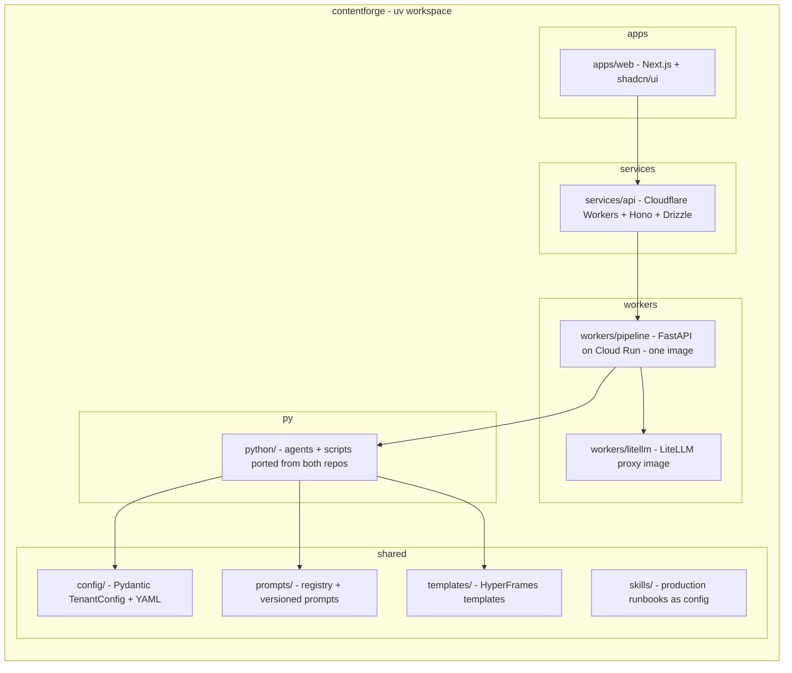
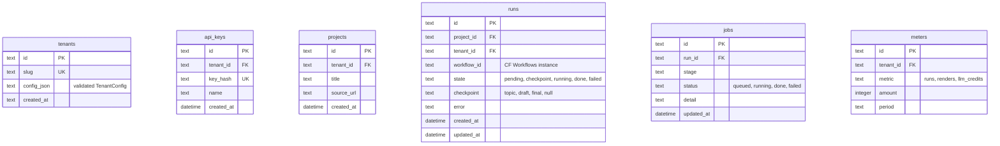
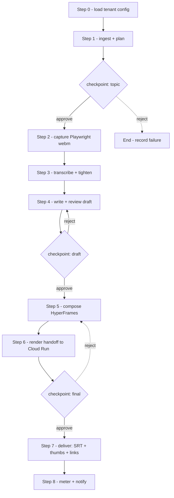
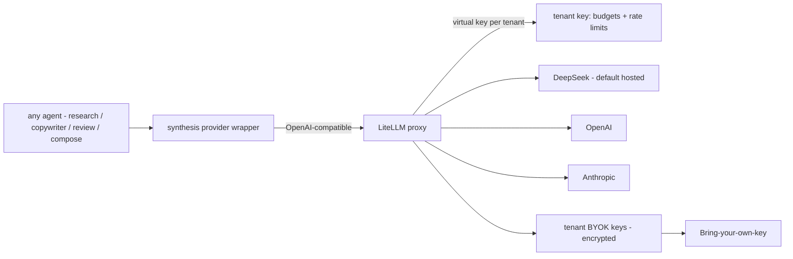
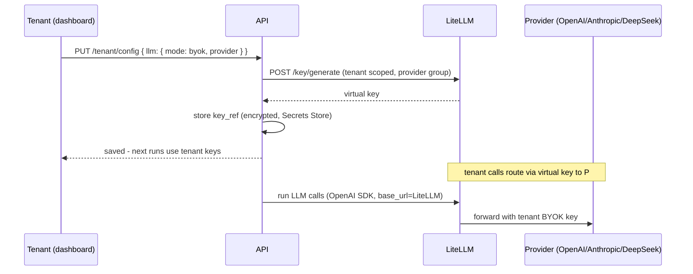
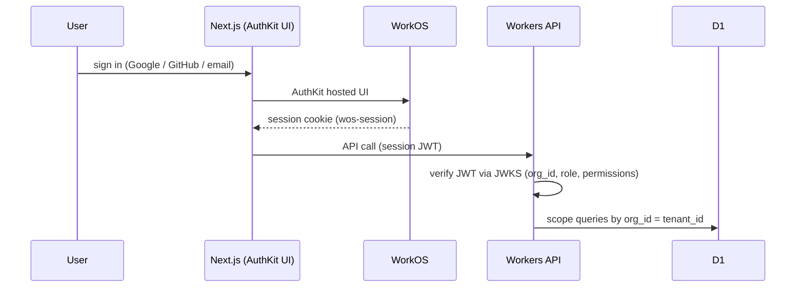
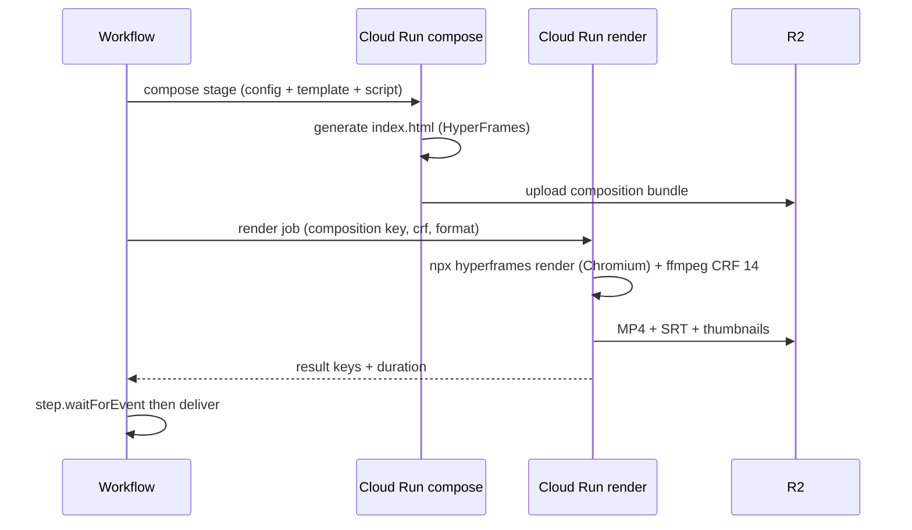

# ContentForge — Low-Level Design

Companion to HLD. Concrete packages, schemas, endpoints, and wiring for the Cloudflare-first architecture. Everything here is a package or proven existing code — nothing custom-built that has a maintained library.

## 1. Monorepo Layout (uv workspace)



Tooling: `uv` workspace (packages: `apps/web`, `services/api`, `workers/pipeline`), `wrangler` for Cloudflare deploys, `gcloud` for Cloud Run, GitHub Actions for CI.

## 2. API Surface (Workers + Hono)

```mermaid
flowchart LR
    R[REST /api/v1] --> A1[POST /runs - start pipeline]
    R --> A2[GET /runs/:id - status + artifacts]
    R --> A3[POST /runs/:id/approve|reject - HITL]
    R --> A4[GET /projects]
    R --> A5[GET|PUT /tenant/config - brand studio]
    R --> A6[POST /capture/recipes - generate recipe]
    R --> A7[GET /media/* - signed R2 URLs]
    A1 & A2 & A3 & A4 & A5 & A6 & A7 --> JWT[WorkOS JWT check - JWKS]
    A1 --> WF[Start Workflow instance]
    A2 --> D1[(D1)]
    A7 --> R2[(R2)]
```

Every request: WorkOS JWT verified at the edge (JWKS), tenant resolved from token `org_id` claim, D1 queries scoped by `tenant_id`. Zod validates request bodies; Hono handles routing/CORS.

## 3. D1 Schema (Drizzle)



Migrations: Drizzle `drizzle-kit` against D1 (wrangler d1 migrations). Media keys in R2 follow `tenants/{tenant_id}/{project_id}/{run_id}/{artifact}`.

## 4. Pipeline Orchestration (Cloudflare Workflows)



Workflow steps: each step is a bounded Worker step that calls a Cloud Run pipeline endpoint (or the LLM via LiteLLM for pure-LLM stages) and `step.waitForEvent` at HITL checkpoints. Step payloads carry R2/D1 keys, not media. `workflows.yaml` + `wrangler.toml` define the workflow and queues. Queues handle capture/render dispatch and delivery notifications (consumer wall-clock 15 min is ample for notify/transcribe).

## 5. Cloud Run Pipeline Service (one image, FastAPI)

```mermaid
flowchart LR
    subgraph IMG[one container - workers/pipeline]
        E1[/ingest - yt-dlp + trafilatura + transcript-api/]
        E2[/plan - agents/strategy + research - Exa + RSS/]
        E3[/capture - Playwright + recipes - webm/]
        E4[/transcribe - faster-whisper word timestamps/]
        E5[/tighten - tighten_video.py + remap_timeline.py/]
        E6[/compose - HyperFrames index.html from config + templates/]
        E7[/render - npx hyperframes render - CRF 10/14/]
        E8[/deliver - SRT + build_thumbnails.py + captions/]
    end
    WF[Workflow steps] -->|HTTP internal| IMG
    IMG --> LLM[LiteLLM - OpenAI-compatible base_url]
    IMG --> R2[(R2)]
```



The existing Python agents and scripts (`agents/`, `services/`, `scripts/tighten_video.py`, `remap_timeline.py`, whisper, ffmpeg, HyperFrames CLI) are reused as-is inside one FastAPI app with per-stage entrypoints. No reimplementation. Entrypoints are internal-only (Workers-service auth: WorkOS service token or Cloud Run IAM / shared secret).

## 6. Agent-Agnostic LLM Layer (LiteLLM)



- LiteLLM runs as a container (same Cloud Run project, scale-to-zero). Master key in Secrets Store; `POST /key/generate` creates one virtual key per tenant with budget + model group.
- The existing `synthesis/openai.py` wrapper changes only its `base_url` to the LiteLLM endpoint — every agent stays on the OpenAI SDK. Agent-agnostic means: no agent knows which provider serves it.
- Hosted mode: tenant key maps to the platform DeepSeek group (metered credits). BYOK mode: tenant key maps to their own provider keys (encrypted at rest by LiteLLM).
- Prompt registry entries can specify `model_family` hint (e.g. review gates tuned for DeepSeek) — LiteLLM aliases route per family.

## 7. Tenant Config (Pydantic)

```yaml
# config/tenants/example.yaml - validated by config/ package
tenant:
  id: t_01
  slug: acme
  brand:
    colors: { primary: "#0D1117", accent: "#D4AF37", bg: "#F5F1E8" }
    fonts: ["Playfair Display", "Inter", "JetBrains Mono"]
  voice: "grade 5-6 plain speech, no em-dashes, spoken-flow"
  persona: config/persona.yaml
  llm:
    mode: hosted            # hosted | byok
    provider: deepseek
    model: deepseek-v4-flash
    key_ref: null           # set when mode=byok
  templates: ["short-form/vox", "long-form/documentary"]
  prompts:
    copywriter: v1.1.2
    review: v1.0.3
  recipes: ["table-walkthrough", "json-api-demo"]
```

Validated by `config/` Pydantic models (the existing `python/config/settings.py` pattern, generalized). A new tenant = a validated blob + LiteLLM virtual key + R2 prefixes — zero code.

## 8. BYOK Flow



## 9. Auth Flow (WorkOS AuthKit)



RBAC: WorkOS roles (`member`, custom) gate dashboard actions; API trusts token claims. Tenant ↔ WorkOS org: 1:1 mapping at provisioning.

## 10. Render Handoff



Workers cannot render (CPU ceiling, no ffmpeg). Cloud Run is the only runtime; compose + render are two entrypoints of the same container. R2 free egress means signed-URL delivery costs nothing.

## 11. Fast-to-Market Package Map

| Need | Package | Where |
|---|---|---|
| Web framework | Next.js + shadcn/ui + Tailwind | apps/web |
| API framework | Hono | services/api |
| ORM | Drizzle + drizzle-kit | services/api |
| Validation | Zod (TS) / Pydantic (Python) | api / workers |
| LLM gateway | LiteLLM proxy (MIT) | workers/litellm |
| Auth | WorkOS AuthKit (+ SDKs) | web + api |
| Capture | Playwright (Python) | workers/pipeline |
| Transcribe | faster-whisper | workers/pipeline |
| Ingest | yt-dlp + youtube-transcript-api + trafilatura | workers/pipeline |
| Research search | Exa + RSS (existing) | workers/pipeline |
| Video | HyperFrames CLI (npx) + ffmpeg | workers/pipeline |
| State/DB | Cloudflare D1 | services/api |
| Media | Cloudflare R2 | services/api + workers |
| Errors | Sentry | web + api + workers |
| Observability | Arize OTEL (existing) | workers/pipeline |
| Analytics | Cloudflare Web Analytics | web |
| Email (P4+) | Resend | services/api |
| Billing (P5) | Stripe | services/api |
| Docs (P4+) | Mintlify | repo |
