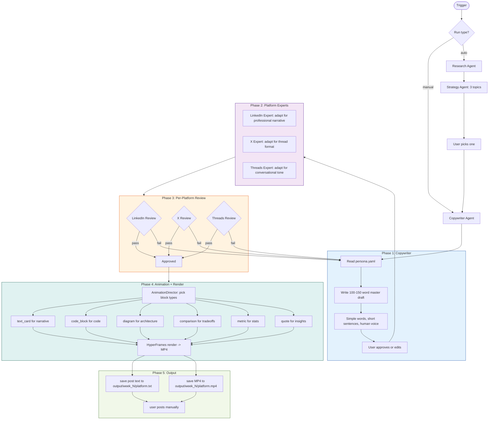

# Production Pipeline (Updated July 2026)

```mermaid
graph TD
    T0([Trigger]) --> T1{Run type?}

    T1 -->|manual| T2[Copywriter Agent]
    T1 -->|auto| T3[Research Agent]
    T3 --> T4[Strategy Agent: 3 topics]
    T4 --> T5[User picks one]
    T5 --> T2

    subgraph Phase1[Phase 1: Copywriter]
        C1[Read persona.yaml]
        C1 --> C2[Write 100-150 word master draft]
        C2 --> C3[Simple words, short sentences, human voice]
        C3 --> C4[User approves or edits]
    end

    T2 --> C1
    C4 --> Phase2

    subgraph Phase2[Phase 2: Platform Experts]
        P1[LinkedIn Expert: adapt for professional narrative]
        P2[X Expert: adapt for thread format]
        P3[Threads Expert: adapt for conversational tone]
    end

    subgraph Phase3[Phase 3: Per-Platform Review]
        R1{LinkedIn Review}
        R2{X Review}
        R3{Threads Review}
        R1 -->|pass| A1[Approved]
        R1 -->|fail| C1
        R2 -->|pass| A1
        R2 -->|fail| C1
        R3 -->|pass| A1
        R3 -->|fail| C1
    end

    Phase2 --> Phase3

    subgraph Phase4[Phase 4: Animation + Render]
        D1[AnimationDirector: pick block types]
        D1 --> D2[text_card for narrative]
        D1 --> D3[code_block for code]
        D1 --> D4[diagram for architecture]
        D1 --> D5[comparison for tradeoffs]
        D1 --> D6[metric for stats]
        D1 --> D7[quote for insights]
        D2 --> E1[HyperFrames render -> MP4]
        D3 --> E1
        D4 --> E1
        D5 --> E1
        D6 --> E1
        D7 --> E1
    end

    A1 --> Phase4

    subgraph Phase5[Phase 5: Output]
        O1[save post text to output/week_N/platform.txt]
        O2[save MP4 to output/week_N/platform.mp4]
        O3[user posts manually]
    end

    E1 --> O1
    E1 --> O2
    O1 --> O3
    O2 --> O3

    style Phase1 fill:#e3f2fd,stroke:#0d47a1
    style Phase2 fill:#f3e5f5,stroke:#4a148c
    style Phase3 fill:#fff3e0,stroke:#e65100
    style Phase4 fill:#e0f2f1,stroke:#004d40
    style Phase5 fill:#f1f8e9,stroke:#33691e
```
