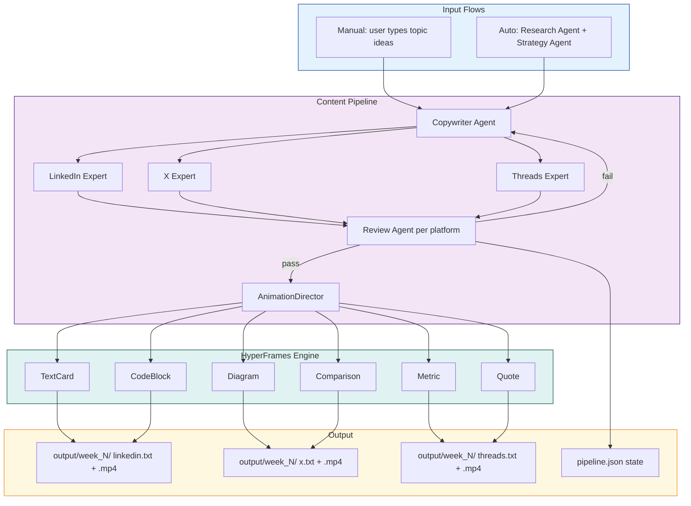

# System Architecture (Updated July 2026)

```mermaid
graph TD
    subgraph Input[Input Flows]
        I1[Manual: user types topic ideas]
        I2[Auto: Research Agent + Strategy Agent]
    end

    subgraph Pipeline[Content Pipeline]
        C[Copywriter Agent]
        LE[LinkedIn Expert]
        XE[X Expert]
        TE[Threads Expert]
        R[Review Agent per platform]
        AD[AnimationDirector]
    end

    subgraph Render[HyperFrames Engine]
        TC[TextCard]
        CB[CodeBlock]
        DG[Diagram]
        CM[Comparison]
        MT[Metric]
        QT[Quote]
    end

    subgraph Storage[Output]
        O1[output/week_N/ linkedin.txt + .mp4]
        O2[output/week_N/ x.txt + .mp4]
        O3[output/week_N/ threads.txt + .mp4]
        S[pipeline.json state]
    end

    I1 --> C
    I2 --> C
    C --> LE
    C --> XE
    C --> TE
    LE --> R
    XE --> R
    TE --> R
    R -->|pass| AD
    R -->|fail| C
    AD --> TC
    AD --> CB
    AD --> DG
    AD --> CM
    AD --> MT
    AD --> QT
    TC --> O1
    CB --> O1
    DG --> O2
    CM --> O2
    MT --> O3
    QT --> O3
    R --> S

    style Input fill:#e3f2fd,stroke:#0d47a1
    style Pipeline fill:#f3e5f5,stroke:#4a148c
    style Render fill:#e0f2f1,stroke:#004d40
    style Storage fill:#fff8e1,stroke:#f57f17
```
