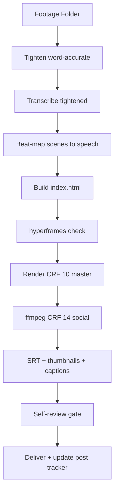

# Video Agent — Production System (HyperFrames)

Self-contained master. Everything needed to build, verify, render, and deliver long-form (16:9) + short-form (9:16) videos. External files are only RUNNABLE artifacts (scripts, templates, media) — all instructions live here.

## Architecture / Workflow



## Production Steps (in order)

1. **Tighten** — word-accurate (never clips a word):
   ```bash
   python/scripts/tighten_words.py <transcript.json> <master.mp4> <tight.mp4> --lead 0.35 --tail 0.35
   ```
   Uses whisper word timestamps (transcript.json). Cut ONLY between words; keeps 0.35s breathing each side; removes only gaps >0.7s. Amplitude-only `silencedetect` tightening is BANNED (clips word tails).
2. **Transcribe the tightened file** — new word timestamps (never reuse old beat timings after any media change).
3. **Beat-map** every scene window to the actual speech segments (title/hook, chips, captures, cards, terminal, demo, CTA, end).
4. **Compose** per the rules below. A/V sync: audio + pip video use the SAME source file with matched `data-start`/`data-media-start` offsets.
5. **Lint + check** (must exit 0):
   ```bash
   npx hyperframes lint && npx hyperframes check
   ```
   Fix `gsap_exit_missing_hard_kill` (add `tl.set(..., {autoAlpha:0}, boundary)`), scrim opacity-0 initial states, and any errors.
6. **Render** master CRF 10, then social CRF 14 (avoids platform re-compression):
   ```bash
   npx hyperframes render --quality high --crf 10 --output <name>-master.mp4
   ffmpeg -i <name>-master.mp4 -vcodec libx264 -crf 14 -preset slow -pix_fmt yuv420p -movflags +faststart -c:a copy <name>.mp4
   ```
7. **Deliver** — SRT, thumbnails, social captions, README (see Delivery section).

## Hard Rules (all formats)

- **Round PiP only — ALWAYS**: Noah's face/footage NEVER full-screen, full-bleed, or background. ONLY a round picture-in-picture (gold ring + glow) over graphics. Implementation: video inside a SQUARE wrapper with `border-radius: 50%; overflow: hidden;` and `width/height 100%`, `object-fit: cover`, plus `clip-path: circle(50%)` on the video. The circle lives on the WRAPPER — radius on the video box renders an OVAL (16:9 intrinsic). 16:9 → bottom-right; 9:16 → bottom-left/bottom-center. No tweens to full-bleed. NEVER scale the pip wrapper via GSAP (transformed wrappers break video containment — fade-only entrance). Do NOT put GSAP width/height/translate tweens on the pip video (Studio/foreign tweens that force a 16:9 box make it oval).
- **Motion graphics ARE the content**: full-screen animated graphics (kinetic type, tilt cards, diagrams, terminal/JSON) carry the story; footage is the accent pip only. No talking-head-led scenes.
- **Thumbnail-flash opener**: open with the thumbnail itself — face (canonical headshot) + bold title visible ~1s (pop 0.25s, fade by 1.5s), then cut into the video. The live pip enters AFTER the opener (first content beat) so title text never overlaps it.
- **Word-accurate no-dead-air**: see step 1. After any tighten, re-transcribe and re-sync every window.
- **No black gaps between scenes** — every scene boundary gets an ANIMATED transition: outgoing clip slides/fades out (~0.5s, power2.in) with a hard-kill `tl.set(..., { autoAlpha: 0 })` at the boundary; the incoming scene lands on the boundary. Never a hard unmount, never a black frame.
- **Browser footage is LIVE, never static**: any web/UI content in a video comes from a LIVE recording with DYNAMIC scroll + zoom (browser-use agent or scripted Playwright recipe) — never screenshots, never frozen full-page grabs. Stage the webm into assets/ with a timed `data-media-start` window.
- **Music (videos ≤1 min ONLY)**: ducks under speech, swells at transitions. **Videos >1 min: NO music bed — SFX cues only.** SFX: 2-3 cue points (whoosh, impact, riser) in EVERY video regardless of runtime. Text scrim for legibility; text between y=20% and y=65% (platform safe zones).
- **Brightness**: brown/Indian skin needs 1.2-1.6 brightness — when in doubt, go brighter.
- **Every video differs from the last**: VFX treatment, cut rhythm, font pairing, music mood, title animation.
- **Post tracker updated** after every render.

## Screen Recording & Integration

1. **Scripted walkthrough** (deterministic, no LLM) — capture pipeline (merged from content-planner; run from repo root):
   ```bash
   python/scripts/capture.py "<url>" --recipe <recipe.json> --format 16:9
   ```
   Recipe JSON drives scroll/click/highlight/wait; gold spotlight class `opencode-spotlight-highlight` injected automatically. Output: `workspace/captures/*.webm` (1920×1080).
2. **Live AI-agent demo** — browser-use agent, Playwright recorder (browser-use 0.13.8's own `record_video_dir` is a NO-OP; wrap it):
   - Launch a Playwright **persistent context with `record_video_dir`** + `--remote-debugging-port=9231`
   - Attach browser-use via `Browser(cdp_url="http://localhost:9231")`, `Agent(task=..., llm=..., use_vision=False)`
   - Prefer OpenAI (`browser_use.llm.openai.chat.ChatOpenAI`, `gpt-4o-mini`); DeepSeek (`ChatDeepSeek`) is flaky at structured output on long prompts.
3. **Stage into the composition**: copy the webm into `assets/`, add a timed `<video>` clip (muted, `data-media-start` to pick the interesting window — pick via the agent's `conversation.json`/scene detection), pip overlay on a higher track.

Verified URL facts (2026-08-23): `docs.langchain.com/use-these-docs` = walkthrough page (server table + commands; recipe `table`/`pre` selectors match here). `docs.langchain.com/mcp` = MCP JSON-RPC endpoint (405 on GET; `POST initialize/tools/list/tools/call` returns real content).

## Delivery (ALWAYS, both formats)

- **SRT captions**: `.srt` with timings from the final word-accurate transcript, timed to the rendered audio (sentence-level cues by default). Upload with timestamps on YouTube/Facebook. IG Reels/TikTok don't accept SRT — offer burned-in captions.
- **Thumbnails**: long-form 1280×720, short-form 1080×1920 via `build_thumbnails.py` — face-centered SQUARE crop of `assets/noah-headshot.png` (never stretch a portrait into a square — crop first), circular crop + gold ring, bold gold title with dark text STROKE, ≤5 words, server/topic chips, dark gradient. Short cover safe zone = center 1080×1350; cover frame ~1.2s into the edit.
- **Social captions**: per-platform post captions per the caption-writer skill voice rules (zero em-dashes, zero emoji, Grade 5-6, hook + save CTA in first ~100 chars, maxed detail).
- **README.md**: delivery doc (files, specs, production notes, captions, commands shown).

## Self-Review Gate (MANDATORY before preview/render)

Review agents MUST self-reflect on the actual output — never deliver from assumptions. Verify programmatically:

1. **Round pip, never full-screen** — measure: wrapper SQUARE + `border-radius: 50%`, video fills (`width/height 100%`, `object-fit: cover`, `clip-path: circle(50%)`). Non-square wrapper or 16:9 video box = OVAL → reject.
2. **No text/element over the pip** — audit every timed element's region vs pip bbox over their shared window.
3. **Thumbnails from the canonical headshot** — file content matches the navy-blue photo, not a stale frame.
4. **Timing synced to the ACTUAL media** — re-transcribed after any tighten; no stale beat timings.
5. **A/V sync** — audio + pip = same source file, matched offsets.
6. **Checks pass** — `npx hyperframes check` exit 0 on the exact delivered files.
7. **Audio per runtime** — ≤1 min: music bed present, ducked under speech; >1 min: NO music, but 2-3 SFX cue points present (whoosh/impact/riser).
8. **Scene transitions** — every scene boundary has an animated exit with a hard-kill set; no black gaps, no hard unmounts.
9. **Browser footage (if any)** — recorded LIVE (browser-use/Playwright) with dynamic scroll + zoom; never static screenshots.

Tooling: `verify_pip.py` (pip geometry), `audit_pip_collisions.py` (timed elements vs pip bbox).

## Templates & Tech Stack

- Templates: `templates/short-form/` (day-in-my-life, desk-setup, transformation — pick matching; never repeat back-to-back per `docs/post-tracker.md`).
- GSAP mandatory (one paused timeline on `window.__timelines`), easing never linear, Lucide inline SVG, custom fonts bundled locally (`fonts/*.woff2`).
- Media: HEVC renders fine (FFmpeg pre-extraction) but transcode to 1080p H.264 for fast proxy if huge; mute all `<video>`, audio on separate `<audio>` from the same file.
- Prompt versioning: bump `version` in this file's frontmatter + `prompts/CHANGELOG.md` + `prompts/registry.yaml`; tag `prompts-vX.Y.Z`.
