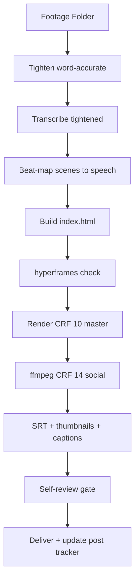

# Video Agent — Production System (HyperFrames)

Self-contained master. Everything needed to build, verify, render, and deliver long-form (16:9) + short-form (9:16) videos. External files are only RUNNABLE artifacts (scripts, templates, media) — all instructions live here.

## Architecture / Workflow



## Production Steps (in order)

1. **Tighten** — word-accurate (never clips a word):
   ```bash
   python/scripts/tighten_words.py <transcript.json> <master.mp4> <tight.mp4> --lead 0.35 --tail 0.35
   ```
   Uses whisper word timestamps (transcript.json). Cut ONLY between words; keeps 0.35s breathing each side; removes only gaps >0.7s. Amplitude-only `silencedetect` tightening is BANNED (clips word tails).
2. **Transcribe the tightened file** — new word timestamps (never reuse old beat timings after any media change).
3. **Beat-map** every scene window to the actual speech segments (title/hook, chips, captures, cards, terminal, demo, CTA, end).
4. **Stage assets from the manifest (both formats)** — read `outputs/<slug>/assets/asset_manifest.md`; stage each WEB webm/png for the chapters it maps to, with `data-media-start` windows matched to the beat-map. A live webm is footage; PNGs are reference-only and NEVER appear in-frame. A chapter with no WEB/POST asset and no MOTION note = incomplete manifest → route back to ASSETS, never improvise a static screenshot.
5. **Compose** per the rules below. A/V sync: audio + pip video use the SAME source file with matched `data-start`/`data-media-start` offsets.
6. **Lint + check** (must exit 0):
   ```bash
   npx hyperframes lint && npx hyperframes check
   ```
   Fix `gsap_exit_missing_hard_kill` (add `tl.set(..., {autoAlpha:0}, boundary)`), scrim opacity-0 initial states, and any errors.
7. **Render** master CRF 10, then social CRF 14 (avoids platform re-compression):
   ```bash
   npx hyperframes render --quality high --crf 10 --output <name>-master.mp4
   ffmpeg -i <name>-master.mp4 -vcodec libx264 -crf 14 -preset slow -pix_fmt yuv420p -movflags +faststart -c:a copy <name>.mp4
   ```
8. **Deliver** — SRT, thumbnails, social captions, README (see Delivery section).

## Hard Rules (all formats)

- **Round PiP only — ALWAYS**: Noah's face/footage NEVER full-screen, full-bleed, or background. ONLY a round picture-in-picture (gold ring + glow) over graphics. Implementation: video inside a SQUARE wrapper with `border-radius: 50%; overflow: hidden;` and `width/height 100%`, `object-fit: cover`, plus `clip-path: circle(50%)` on the video. The circle lives on the WRAPPER — radius on the video box renders an OVAL (16:9 intrinsic). 16:9 → bottom-right; 9:16 → bottom-left/bottom-center. No tweens to full-bleed. NEVER scale the pip wrapper via GSAP (transformed wrappers break video containment — fade-only entrance). Do NOT put GSAP width/height/translate tweens on the pip video (Studio/foreign tweens that force a 16:9 box make it oval).
- **Motion graphics ARE the content**: full-screen animated graphics (kinetic type, tilt cards, diagrams, terminal/JSON) carry the story; footage is the accent pip only. No talking-head-led scenes.
- **Thumbnail-flash opener**: open with the thumbnail itself — face (canonical headshot) + bold title visible ~1s (pop 0.25s, fade by 1.5s), then cut into the video. The live pip enters AFTER the opener (first content beat) so title text never overlaps it.
- **HOOK — montage open (edit block)**: when the script opens with a `## HOOK — montage open (edit block, NOT spoken — for the video editing agent)` block, execute it as the cold open directly after the thumbnail flash. Pull each listed money line verbatim from its chapter's recording, cut to the block's beat sheet with SFX hits, animated transitions, and word-synced captions. The block targets BOTH the LONG-FORM master and the SHORT-FORM cuts pulled from it; it is never recorded as VO (single-chapter shorts open on their own chapter line — see the block's short-form guidance).
- **Word-accurate no-dead-air**: see step 1. After any tighten, re-transcribe and re-sync every window.
- **No black gaps between scenes** — every scene boundary gets an ANIMATED transition: outgoing clip slides/fades out (~0.5s, power2.in) with a hard-kill `tl.set(..., { autoAlpha: 0 })` at the boundary; the incoming scene lands on the boundary. Never a hard unmount, never a black frame.
- **Browser footage is LIVE, never static**: any web/UI content in a video comes from a LIVE recording with DYNAMIC scroll + zoom (browser-use agent or scripted Playwright recipe) — never screenshots, never frozen full-page grabs. Stage the webm into assets/ with a timed `data-media-start` window.
- **NO MUSIC — any runtime, any format**: music beds don't suit tech videos (vocal tracks and lo-fi chill are banned too). **SFX in BOTH shorts AND long-form — mandatory**: 2-3 cue points (whoosh, impact, riser) in EVERY video regardless of runtime or format. **Audio mix floor: voice = 0dB reference; every SFX cue peaks ≤ -18dB relative to the voice stem** — duck SFX under speech, never compete with it (loud SFX also corrupts downstream ASR/transcription). Text scrim for legibility; text between y=20% and y=65% (platform safe zones).
- **Brightness**: brown/Indian skin needs 1.2-1.6 brightness — when in doubt, go brighter.
- **Every video differs from the last**: VFX treatment, cut rhythm, font pairing, SFX pattern, title animation.
- **Post tracker updated** after every render.

## Assets in the edit — WEB + POST (long-form and short-form)

Every WEB/POST frame in BOTH formats comes from the staged asset set
(`outputs/<slug>/assets/`), bound to the beats in `asset_manifest.md` (production step 4).
Noah's face stays a round pip; assets and motion graphics carry the screen.

- **Staging** — only files the manifest lists as WEB are footage (the `.webm`). PNGs
  (`-top/-mid/-full`) are reference only (storyboard, thumbnails, review) and never burned
  in-frame. POST rows become replica cards built from the manifest's verified quotes, or
  real captures when present.
- **Timing** — each asset window is tied to the beat that SHOW-cues it: `data-media-start`
  matches the recorded utterance so the page motion lands on the spoken line (re-transcribe
  and re-beat-map after any tighten — stale timings are a self-review reject). Window opens
  on the beat's trigger word, holds while the beat speaks, closes at the scene transition.
  No asset outlives its beat.
- **Transitions** — asset scenes enter/exit with real kit transitions (crossfade / blur for
  calm proof pages, push / wipe for claim-vs-contrast turns, hard cuts ONLY inside the HOOK
  montage open). No bare unmounts, no black frames (existing rule).
- **Zoom / reframe on webm** — the recording already scrolls; add a slow reframe to push
  emphasis to the figure the beat names: GSAP transform on the FOOTAGE wrapper (punch-in up
  to ~1.3×, pan to the number/table; easing never linear). NEVER transform the face-pip
  wrapper (transform-banned — fade-only entrance). 9:16 shorts re-crop the same clip to the
  vertical center band (1080×1350 safe zone) and punch tighter on the numbers.
- **Effects over assets** — SFX (whoosh / impact / riser, ≤-18 dB vs the 0 dB voice stem)
  land on asset entry and on the emphasized figure; the gold spotlight class
  (`.opencode-spotlight-highlight`) marks the exact number/table being spoken; word-synced
  captions continue over assets (shorts as-I-speak, long-form chunked — delivery rule).
- **Short-form cuts** — shorts pull from the master; each short's single beat re-stages the
  same asset windows (cropped 9:16, tighter punches), so timing, captions, and SFX stay
  consistent between formats.

## Screen Recording & Integration

1. **Scripted walkthrough** (deterministic, no LLM) — capture pipeline (merged from content-planner; run from repo root):
   ```bash
   python/scripts/capture.py "<url>" --recipe <recipe.json> --format 16:9
   ```
   Recipe JSON drives scroll/click/highlight/wait; gold spotlight class `opencode-spotlight-highlight` injected automatically. Output: `workspace/captures/*.webm` (1920×1080).
2. **Live AI-agent demo** — browser-use agent, Playwright recorder (browser-use 0.13.8's own `record_video_dir` is a NO-OP; wrap it):
   - Launch a Playwright **persistent context with `record_video_dir`** + `--remote-debugging-port=9231`
   - Attach browser-use via `Browser(cdp_url="http://localhost:9231")`, `Agent(task=..., llm=..., use_vision=False)`
   - Prefer OpenAI (`browser_use.llm.openai.chat.ChatOpenAI`, `gpt-4o-mini`); DeepSeek (`ChatDeepSeek`) is flaky at structured output on long prompts.
3. **Stage into the composition**: copy the webm into `assets/`, add a timed `<video>` clip (muted, `data-media-start` to pick the interesting window — pick via the agent's `conversation.json`/scene detection), pip overlay on a higher track.

Verified URL facts (2026-08-23): `docs.langchain.com/use-these-docs` = walkthrough page (server table + commands; recipe `table`/`pre` selectors match here). `docs.langchain.com/mcp` = MCP JSON-RPC endpoint (405 on GET; `POST initialize/tools/list/tools/call` returns real content).

## Delivery (ALWAYS, both formats)

- **Burned-in captions on EVERY video — both formats, no exceptions. Shorts are WORD-SYNCED (as-I-speak)**: in SHORT-FORM only the word currently being spoken appears on screen — one word at a time (or the active word highlighted in a just-spoken run), timed to the final word-accurate transcript. Never show words ahead of the voice in shorts; never a sentence block lagging or leading the voice. LONG-FORM may display more words at once — natural phrase/sentence chunks are fine (viewers read ahead on longer formats) — but burned-in captions must still be present and must never lag behind the spoken line. `.srt` sidecar ships with long-form for YouTube/Facebook upload/accessibility. Caption font styling follows the designer font pairing for the video.
- **Thumbnails**: long-form 1280×720, short-form 1080×1920 via `build_thumbnails.py` — face-centered SQUARE crop of `assets/noah-headshot.png` (never stretch a portrait into a square — crop first), circular crop + gold ring, bold gold title with dark text STROKE, ≤5 words, server/topic chips, dark gradient. Short cover safe zone = center 1080×1350; cover frame ~1.2s into the edit.
- **Social posts**: per-platform post copy per the post-writer skill voice rules (zero em-dashes, zero emoji, Grade 5-6, hook + save CTA in first ~100 chars, maxed detail). Separate from the burned-in captions above — post text lives under the video, not on it.
- **README.md**: delivery doc (files, specs, production notes, captions, commands shown).

## Self-Review Gate (MANDATORY before preview/render)

Review agents MUST self-reflect on the actual output — never deliver from assumptions. Verify programmatically:

1. **Round pip, never full-screen** — measure: wrapper SQUARE + `border-radius: 50%`, video fills (`width/height 100%`, `object-fit: cover`, `clip-path: circle(50%)`). Non-square wrapper or 16:9 video box = OVAL → reject.
2. **No text/element over the pip** — audit every timed element's region vs pip bbox over their shared window.
3. **Thumbnails from the canonical headshot** — file content matches the navy-blue photo, not a stale frame.
4. **Timing synced to the ACTUAL media** — re-transcribed after any tighten; no stale beat timings.
5. **A/V sync** — audio + pip = same source file, matched offsets.
6. **Captions burned-in — shorts word-synced, long-form chunked** — captions visible IN the video frames. Shorts: only the word being spoken is on screen (or active-word highlight), never words ahead of the voice. Long-form: phrase/sentence chunks permitted but never lagging the spoken line. Long-form also ships .srt.
7. **Checks pass** — `npx hyperframes check` exit 0 on the exact delivered files.
8. **Audio — SFX only, BOTH formats, voice-priority mix** — NO music bed at any runtime (tech-content rule); shorts AND long-form each carry 2-3 SFX cue points (whoosh/impact/riser) at ≤ -18dB relative to the 0dB voice stem — check levels, not just cue count.
9. **Scene transitions** — every scene boundary has an animated exit with a hard-kill set; no black gaps, no hard unmounts.
10. **Browser footage (if any)** — recorded LIVE (browser-use/Playwright) with dynamic scroll + zoom; never static screenshots.
11. **Motion Graphics Standard met** — kinetic-type hook, speech-synced keyword moment, animated scene transitions, choreographed diagrams (no static diagram), and (long-form) one Three.js/WebGL beat — per the Motion Graphics Standard section. Motion verbs are real kit rule names, not invented. WebGPU beats pass via their WebGL2/Canvas fallback in headless renderers; custom shaders are frame-locked (no `performance.now()`/delta-time/`iTime`).

12. **Assets staged from the manifest** — every WEB frame in both formats is a `.webm`
    from `outputs/<slug>/assets/` per `asset_manifest.md`; no static PNG in-frame anywhere;
    every manifest row is resolved (WEB staged, POST built as a card, MOTION beat present) —
    unresolved row = reject and route back to ASSETS.

Tooling: `verify_pip.py` (pip geometry), `audit_pip_collisions.py` (timed elements vs pip bbox).

## Motion Graphics Standard (MANDATORY — every video, both formats)

Motion is the content (hard rule above). This is the minimum creative bar for ALL videos — every build must include each item, then push further where the beat earns it. Rule names come from the global animation kit `~/.qwen/skills/hyperframes-animation/rules-index.md` (load it; never invent motion verbs — the build agent animates directly from these lines).

1. **Kinetic-type hook** — the hook lands as kinetic type from the kit's named text-animation effects (slam/stamp/typewriter/waterfall — rotate per video, never the same twice in a row).
2. **Speech-synced keyword moments** — key terms GLOW or LOCK IN on the spoken word (`asr-keyword-glow`, `discrete-text-sequence`). Word-accurate transcripts drive it: the element that matches what's said lights up the instant it's spoken.
3. **Animated scene transitions** — every scene boundary uses a real HyperFrames transition (crossfade / blur / push / wipe from the transitions catalog), never a bare cut between scenes.
4. **Diagram/chart choreography** — recurring technical visuals (loops, routes, comparisons, ladders) move: routes draw themselves (`svg-path-draw`), cards enter staggered (`waterfall-entry`, `spring-pop-entrance`), numbers count/roll up (`discrete-text-sequence`). No static diagram ever sits on screen.
5. **At least one Three.js / WebGL beat per long-form** — a 3D data-scape, shader post-fx, or WebGPU particle field that physically dramatizes the concept (model worlds lifting on a score, a benchmark ladder in 3D, token-flow particles). Shorts use 3D when the beat needs it (≥1 per video once the shot demands it). Earned, never wallpaper: if the 3D doesn't clarify the concept, cut it and keep the GSAP treatment. **WebGPU/TypeGPU beats are optional, not required** — headless render environments (Docker/CI with SwiftShader/ANGLE) often lack WebGPU, so any WebGPU beat MUST ship a WebGL2 (Three.js) or 2D Canvas fallback path; Gate #11 accepts the fallback (never false-reject a build for missing WebGPU in a headless renderer).
6. **Seek-safe determinism holds for 3D too — frame-locked stepping** — single paused timeline, `hf-seek`, `AnimationMixer` for Three; no `Math.random`/`Date.now`; 3D motion is keyframed, not drifting. Custom Three.js/GLSL shaders MUST step by frame (`frame / FPS`, or a time value derived from the paused master timeline) — never `performance.now()`, delta-time accumulation, or a raw `iTime` clock. Frame-based stepping gives bit-exact `hf-seek` determinism across GPU frame rates.

SFX (whoosh/impact/riser, both formats) land ON the motion beats — impact on title reveals, riser before the payoff diagram — at ≤ -18dB relative to the 0dB voice stem.

## Templates & Tech Stack

- Templates: `templates/short-form/` (day-in-my-life, desk-setup, transformation — pick matching; never repeat back-to-back per `docs/post-tracker.md`).
- GSAP mandatory (one paused timeline on `window.__timelines`), easing never linear, Lucide inline SVG, custom fonts bundled locally (`fonts/*.woff2`).
- Media: HEVC renders fine (FFmpeg pre-extraction) but transcode to 1080p H.264 for fast proxy if huge; mute all `<video>`, audio on separate `<audio>` from the same file.
- Prompt versioning: bump `version` in this file's frontmatter + `prompts/CHANGELOG.md` + `prompts/registry.yaml`; tag `prompts-vX.Y.Z`.
